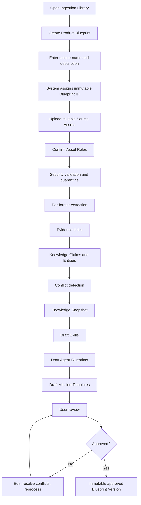
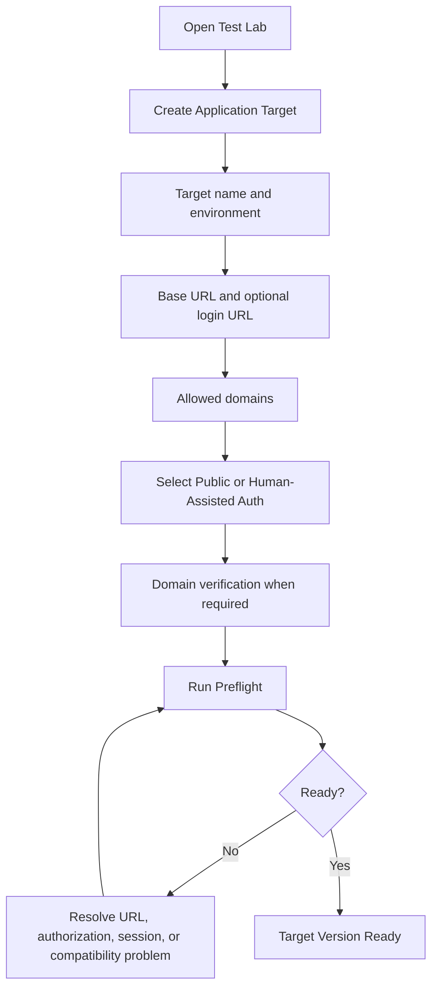
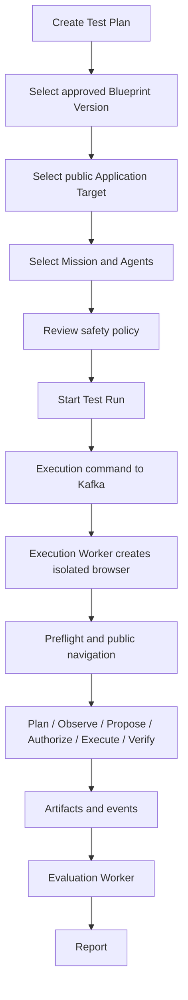
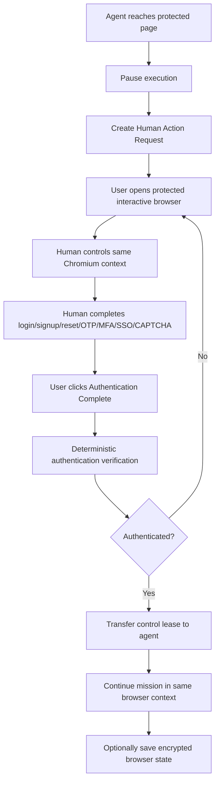
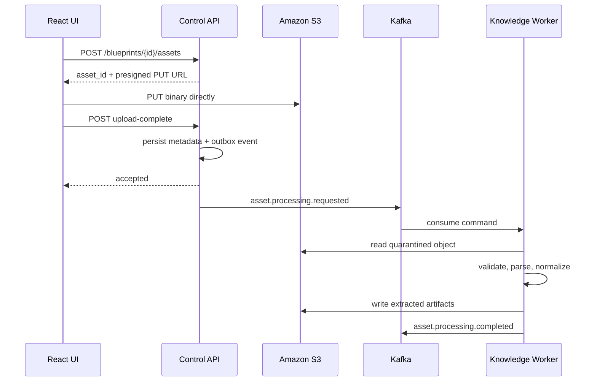
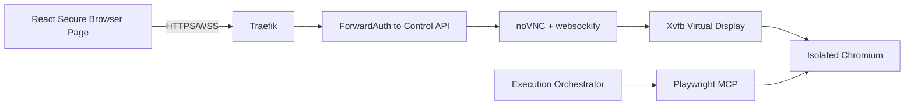
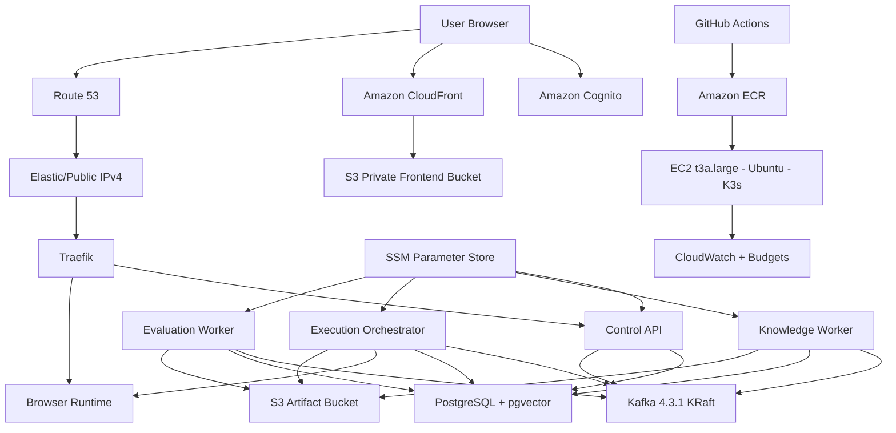

# MarketTwin

> **V1 status:** Architecture frozen; implementation ready to begin  
> **Frontend:** React + TypeScript  
> **Backend:** FastAPI + Python  
> **Agent runtime:** Google ADK  
> **Browser automation:** Playwright MCP + direct Playwright  
> **Messaging:** Apache Kafka in KRaft mode  
> **Data:** PostgreSQL + pgvector + Amazon S3  
> **Deployment:** Docker, K3s/Kubernetes, Helm, Terraform, GitHub Actions, AWS  
> **Primary V1 constraint:** Build a real agentic microservices platform while keeping AWS infrastructure cost as low as practical.

MarketTwin is an **evidence-grounded agentic product-testing platform**.

A user teaches MarketTwin how a product is intended to work by creating a **Product Blueprint** and uploading multiple videos, documents, spreadsheets, screenshots, business rules, test files, expected outputs, and safety policies. MarketTwin converts those sources into structured evidence, product knowledge, reusable Skills, editable Agent Blueprints, and Mission Templates.

The user then creates an **Application Target** for an authorized public, staging, QA, demo, local, or production application. A version-pinned **Test Plan** connects the approved Blueprint, target, mission, agents, persona policy, test assets, safety rules, and execution limits.

MarketTwin executes the approved mission using Google ADK, Playwright MCP, direct Playwright, Kafka, and deterministic policy enforcement. Public pages can be tested automatically. Protected flows use **human-in-the-loop authentication**: the agent pauses, the user completes login, signup, password reset, OTP, MFA, SSO, magic-link, or CAPTCHA steps in the same isolated browser, MarketTwin verifies success, and the agent resumes in that same browser context.

Every report is backed by exact evidence such as source timestamps, document pages, spreadsheet rows, browser steps, screenshots, accessibility snapshots, console errors, network failures, traces, and deterministic assertions.

---

## Repository purpose

This README is the complete V1 build contract for the MarketTwin repository. It explains:

- The business problem and the value MarketTwin provides
- Exactly what is and is not included in V1
- The full end-to-end user experience
- How multi-file and video ingestion works
- How evidence, knowledge, Skills, Agents, and Missions are generated
- How public and protected websites are tested
- How human-assisted authentication works
- How Playwright MCP and Google ADK are used
- The microservices and their ownership boundaries
- PostgreSQL, pgvector, S3, Kafka, API, and event designs
- The React + TypeScript route and feature structure
- Docker Compose and local Kubernetes setup
- The minimal-cost AWS deployment architecture
- Terraform, Helm, ECR, Cognito, CloudFront, SSM, and GitHub Actions
- Security, SSRF, prompt injection, file parsing, tenancy, and secret handling
- Reliability, retries, idempotency, outbox, DLQ, backups, and recovery
- V1 implementation phases, test matrix, known limitations, and Definition of Done

The companion [`docs/ARCHITECTURE.md`](docs/ARCHITECTURE.md) should contain the same frozen architectural decisions in architecture-document form. This README is the repository-facing explanation and implementation guide.

---

## V1 in one diagram

```text
MULTIPLE PRODUCT SOURCES
Videos + PDFs + DOCX + PPTX + XLSX + CSV + images + JSON/YAML/XML
        |
        v
PRODUCT BLUEPRINT
Versioned, source-backed product knowledge
        |
        +--> Evidence Units
        +--> Knowledge Claims
        +--> Conflicts and open questions
        +--> Vector embeddings
        +--> Knowledge entities and relationships
        |
        v
SKILLS
Atomic reusable capabilities
        |
        v
AGENT BLUEPRINTS
Editable declarative agent definitions
        |
        v
MISSION TEMPLATES
Approved reusable test objectives
        |
        v
APPLICATION TARGET
Site name + URL + environment + authorization + authentication mode
        |
        v
TEST PLAN
Pinned Blueprint + Target + Mission + Agents + Persona + Assets + Policy
        |
        v
KAFKA EXECUTION COMMAND
        |
        v
EXECUTION WORKER
Google ADK + Policy Engine + Playwright MCP + direct Playwright
        |
        +--> Public test: run automatically
        |
        +--> Protected test:
              pause agent
              human controls same isolated browser
              complete login/signup/reset/OTP/MFA/SSO/CAPTCHA
              verify authentication
              return control to agent
        |
        v
EVIDENCE
Steps + screenshots + snapshots + traces + console/network results
        |
        v
EVALUATION
Deterministic assertions + trajectory review + semantic evaluation
        |
        v
REPORT
Evidence-backed findings, scores, confidence, limitations, recommendations
```

---

## What we are building in V1

### Product and workspace capabilities

- MarketTwin user authentication through Amazon Cognito
- Workspaces and workspace membership
- Product Blueprint creation with immutable generated IDs
- Blueprint versions, approvals, and activity history
- Multi-asset upload through presigned S3 URLs
- Asset role assignment and processing status
- Source-backed knowledge review
- Conflict and unresolved-question resolution
- Skill, Agent Blueprint, and Mission Template CRUD
- Immutable approved versions and dependency checks
- Application Target creation
- Target authorization and domain verification
- Public and human-assisted authentication modes
- Target preflight
- Test Plan creation with exact version pinning
- Live Test Run monitoring
- Human Action Requests
- Evidence inspection
- Final reports

### Ingestion capabilities

V1 supports controlled ingestion of:

- MP4, MOV, and WEBM videos
- PDF and DOCX documents
- PPTX presentations
- XLSX and CSV spreadsheets
- PNG, JPG, JPEG, and WEBP images
- TXT, Markdown, and HTML text sources
- JSON, YAML, and XML structured files

The Knowledge Worker performs:

- File validation and quarantine
- Video metadata inspection
- Audio extraction and transcription
- Scene and keyframe detection
- Narration-to-screen alignment
- Intent-level action extraction
- Document hierarchy and table extraction
- Spreadsheet structure, formula, and scenario extraction
- Visual screen understanding
- Evidence normalization
- Knowledge claim generation
- Conflict detection
- Embedding generation
- Knowledge graph representation in PostgreSQL
- Draft Skill generation
- Draft Agent Blueprint generation
- Draft Mission Template generation
- Quality and confidence checks

### Browser-testing capabilities

- Public authorized page testing
- Production, staging, QA, demo, and local targets
- URL normalization and SSRF protection
- Domain allowlists
- Target preflight
- Isolated Chromium browser contexts
- Accessibility-based semantic actions through Playwright MCP
- Direct Playwright lifecycle, tracing, screenshots, assertions, console, and network handling
- Deterministic policy checks before every action
- Step, time, popup, redirect, download, and domain limits
- Live SSE events
- Kafka command/event orchestration
- Browser evidence collection
- Bounded retry and backtracking
- Browser crash and interrupted-run handling

### Human-in-the-loop authentication

V1 handles protected flows by transferring temporary control of the same isolated Chromium session to the user.

Supported human-assisted steps include:

- Login
- Signup
- Password reset
- Email OTP
- SMS OTP
- Push MFA
- Authenticator MFA
- SSO
- Magic links
- Human-completed CAPTCHA
- Reauthentication when a session expires

The system does not collect target-site production credentials in the normal MarketTwin form. The user enters them directly inside the isolated target browser. During human control, agent browser tools are disabled. After MarketTwin verifies the authenticated state, control returns to the agent in the same browser context.

### Evaluation and reports

- Deterministic outcome assertions
- Tool-trajectory evaluation
- Policy-compliance evaluation
- Semantic rubric evaluation
- Evidence validation
- Finding confidence
- Reproducibility metadata
- Journey-completion score
- Friction and clarity findings
- Trust-readiness findings
- Technical errors
- Policy violations
- Report limitations
- Evidence-linked recommendations

---

## What V1 intentionally does not include

- Automatic CAPTCHA solving or bypass
- MFA bypass
- Guaranteed passkey or physical security-key support
- Automated payment
- Automated email or SMS sending
- Unrestricted account deletion
- Unauthorized third-party testing
- General-purpose crawling or scraping
- Multiple simultaneous browser sessions
- Cross-browser testing
- Native mobile testing
- Customer-hosted runner
- Connected local-browser extension
- EKS, MSK, RDS, NAT Gateway, or multiple EC2 nodes
- Neo4j, OpenSearch, Redis, or a separate vector database
- Fully autonomous self-modifying agents
- Product-market-fit prediction
- Replacement of real user research
- Guaranteed correctness of generated Skills without review

---

## V1 service map

| Component | Responsibility | V1 deployment |
|---|---|---|
| React + TypeScript frontend | User experience, live monitoring, review, reports | S3 + CloudFront |
| Control API | REST, SSE, authorization, CRUD, run creation, outbox | K3s Deployment |
| Knowledge Worker | Multi-file ingestion, evidence, knowledge, Skills, Agents, Missions | K3s Deployment |
| Execution Orchestrator | ADK missions, policy, control transfer, Kafka execution | K3s Deployment |
| Browser Runtime | Playwright MCP, Chromium, Xvfb, noVNC, direct Playwright | Same execution pod/runtime boundary |
| Evaluation Worker | Assertions, trajectory review, findings, reports | K3s Deployment |
| PostgreSQL + pgvector | Transactional data, versions, vectors, graph tables, audit | K3s StatefulSet + EBS |
| Apache Kafka | Commands, events, retries, decoupling | K3s StatefulSet + EBS |
| Amazon S3 | Source assets, evidence, traces, reports, backups | AWS managed |
| Amazon Cognito | MarketTwin account authentication | AWS managed |
| Amazon ECR | Container registry | AWS managed |
| SSM Parameter Store | Small secrets and references | AWS managed |
| CloudWatch + Budgets | Minimum monitoring and cost alerts | AWS managed |

---

## Minimal-cost AWS V1

The hosted V1 deliberately avoids high fixed-cost managed infrastructure.

### Used

- One `t3a.large` EC2 instance
- One 50 GB gp3 EBS volume
- Single-node K3s
- S3 and CloudFront for the frontend
- S3 for source and evidence artifacts
- ECR for images
- Cognito for MarketTwin authentication
- SSM Parameter Store
- Systems Manager Session Manager
- Route 53
- CloudWatch basic alarms
- AWS Budgets
- GitHub Actions with AWS OIDC

### Not used in V1

- Amazon EKS
- Amazon MSK
- Amazon RDS
- NAT Gateway
- Application Load Balancer
- ElastiCache
- OpenSearch
- Neptune
- EFS
- Multi-AZ
- Multiple worker nodes

### Cost expectation

- **Development/demo mode:** approximately `$20–25/month` before model and transcription costs when EC2 is stopped while unused.
- **Always-on public V1:** approximately `$65–80/month` before model and transcription costs.

The frontend remains available through S3/CloudFront even when the backend EC2 instance is stopped.

---

## Implementation order

1. Freeze schemas, APIs, events, and ADRs.
2. Create the monorepo and local infrastructure.
3. Build React + TypeScript shell and Cognito authentication.
4. Build FastAPI, PostgreSQL, Alembic, outbox, and Kafka foundations.
5. Complete the first ingestion vertical slice.
6. Complete the first public-browser vertical slice.
7. Add full multi-file knowledge synthesis.
8. Add Agent Blueprints, Missions, and Test Plans.
9. Add human-assisted authentication and same-context resume.
10. Add deterministic and semantic evaluation.
11. Deploy through local k3d/K3s and Helm.
12. Provision AWS through Terraform.
13. Add GitHub Actions build, deployment, start/stop, backup, and rollback.
14. Complete the security, reliability, recovery, and cost test matrix.

---

## First executable vertical slice

Do not start by building every agent and parser.

The first end-to-end result must be:

```text
Create Product Blueprint
→ upload one short MP4 to MinIO/S3
→ publish Kafka ingestion command
→ extract transcript and keyframes
→ create one Evidence Unit
→ generate one draft Skill
→ approve the Skill
→ create one public Application Target
→ execute one safe browser mission
→ capture screenshot and accessibility snapshot
→ publish execution event
→ stream progress through SSE
→ display the result in React
```

Once this works, expand the same contracts rather than redesigning the platform.

---

## Local quick start

### Prerequisites

- Git
- Docker Desktop or Docker Engine
- Docker Compose
- Node.js current LTS
- pnpm
- Python 3.12
- uv
- FFmpeg
- kubectl
- Helm
- k3d
- Terraform
- AWS CLI

### Clone and install

```bash
git clone <repository-url>
cd markettwin

corepack enable
pnpm install
uv sync
```

### Start local infrastructure

```bash
docker compose -f infra/compose/docker-compose.yml up -d postgres kafka minio
```

### Start frontend

```bash
pnpm --filter markettwin-web dev
```

### Start API

```bash
uv run --package control-api fastapi dev
```

### Start workers

Run the Knowledge Worker, Execution Orchestrator, Browser Runtime, and Evaluation Worker individually while developing so logs and failures remain easy to inspect.

### Local Kubernetes validation

```bash
k3d cluster create markettwin \
  --agents 0 \
  --servers 1 \
  --port "8080:80@loadbalancer" \
  --port "8443:443@loadbalancer"

helm upgrade --install markettwin infra/helm/markettwin \
  --namespace markettwin \
  --create-namespace \
  -f infra/helm/markettwin/values-local.yaml
```

---

## Suggested repository status checklist

The repository should track implementation progress using this checklist.

### Foundation

- [ ] Monorepo initialized
- [ ] React + TypeScript Vite application
- [ ] Python uv workspaces
- [ ] Docker Compose
- [ ] PostgreSQL + pgvector
- [ ] Kafka KRaft
- [ ] MinIO
- [ ] Alembic
- [ ] Transactional outbox
- [ ] Processed-event idempotency
- [ ] Shared event schemas
- [ ] OpenAPI-generated TypeScript client

### Ingestion

- [ ] Product Blueprint CRUD
- [ ] Presigned asset upload
- [ ] Asset role classification
- [ ] Video processing
- [ ] PDF/DOCX/PPTX processing
- [ ] XLSX/CSV processing
- [ ] Image processing
- [ ] JSON/YAML/XML processing
- [ ] Evidence Units
- [ ] Knowledge Claims
- [ ] Conflict resolution
- [ ] pgvector embeddings
- [ ] Knowledge entities and relationships
- [ ] Skill generation
- [ ] Agent Blueprint generation
- [ ] Mission generation
- [ ] Approval and versioning

### Target and execution

- [ ] Application Target CRUD
- [ ] Domain authorization
- [ ] SSRF-safe preflight
- [ ] Public execution mode
- [ ] Test Plan version pinning
- [ ] Google ADK workflow
- [ ] Playwright MCP
- [ ] Direct Playwright
- [ ] Policy engine
- [ ] Live SSE events
- [ ] Evidence capture
- [ ] Browser cleanup and reconciliation

### Human assistance

- [ ] Protected-flow detection
- [ ] Human Action Request
- [ ] Xvfb
- [ ] x11vnc
- [ ] noVNC
- [ ] websockify
- [ ] One-time connection tokens
- [ ] Human/agent control lease
- [ ] Authentication verification
- [ ] Same-context agent resume
- [ ] Optional encrypted state reuse
- [ ] Timeout and cancellation

### Evaluation and reporting

- [ ] Deterministic assertions
- [ ] Trajectory evaluation
- [ ] Semantic rubrics
- [ ] Finding schema
- [ ] Evidence viewer
- [ ] Final report
- [ ] Confidence and reproducibility
- [ ] Report limitations

### Infrastructure

- [ ] Helm chart
- [ ] Local k3d validation
- [ ] Terraform modules
- [ ] S3 + CloudFront frontend
- [ ] Cognito
- [ ] EC2 + K3s
- [ ] EBS
- [ ] ECR
- [ ] SSM
- [ ] Route 53
- [ ] CloudWatch alarms
- [ ] AWS Budgets
- [ ] GitHub Actions OIDC
- [ ] Start/stop workflow
- [ ] Backup and restore
- [ ] Rollback workflow

---

# Complete V1 technical contract

The remainder of this README contains the complete detailed V1 specification and rationale.


## Executive summary

MarketTwin is an **evidence-grounded agentic product-testing platform**.

A product owner teaches MarketTwin how an application is intended to work by creating a **Product Blueprint** and uploading multiple source assets such as:

- Product walkthrough videos
- Screen recordings
- PDF requirements
- Word documents
- PowerPoint presentations
- Excel decision tables
- CSV test cases
- Screenshots and UI references
- Sample files used during testing
- Expected outputs and ground truth
- Safety and business-rule documents

MarketTwin processes each source asset, extracts structured evidence, creates a versioned product-knowledge model, detects conflicts, and generates:

- Reusable **Skills**
- Editable **Agent Blueprints**
- Reusable **Mission Templates**
- Open questions and unresolved conflicts
- Suggested personas or behavioral evaluation policies

The user then creates an **Application Target** containing the site name, environment, URL, allowed domains, authorization status, and authentication mode.

The user creates a **Test Plan** that pins:

- One approved Product Blueprint version
- One Application Target version
- One Mission Template version
- Exact Agent Blueprint and Skill versions
- Persona policy
- Test assets
- Safety policy
- Runtime limits

The **Execution Worker** runs the approved mission through Google ADK, Playwright MCP, and direct Playwright operations. Every browser action is proposed, checked by a deterministic policy engine, executed, verified, and recorded as evidence.

For public pages, testing can run automatically. For login, signup, password reset, OTP, MFA, SSO, magic links, and CAPTCHA, MarketTwin V1 uses **human-in-the-loop interactive browser control**. The user temporarily controls the same isolated Chromium session through a protected noVNC connection. After authentication is verified, control is transferred back to the agent in the same browser context.

The result is an evidence-backed report containing:

- What completed successfully
- Where the journey failed
- Usability and trust friction
- Technical failures
- Policy violations
- Screenshots, accessibility snapshots, trace references, console/network evidence
- Deterministic scores
- LLM-assisted explanations
- Confidence and reproducibility metadata

---

# 1. Business problem

## 1.1 The problem product teams face

Product teams frequently need to answer questions such as:

- Can a new user understand what the product does?
- Can a user complete the main workflow?
- Does onboarding create unnecessary friction?
- Does the product make privacy, security, pricing, and limitations clear?
- Does the application behave according to product requirements?
- Do browser errors or failed network requests occur?
- What changed between the documented workflow and the current application?
- Does the product work under different behavioral assumptions?
- Can teams reproduce the same test after the UI changes?
- Can teams review exact evidence instead of trusting a model-generated opinion?

Today, these questions are addressed through a fragmented combination of:

- Manual QA
- Product walkthroughs
- User-testing sessions
- Playwright/Cypress scripts
- Accessibility scans
- Analytics
- Requirements documents
- Spreadsheets
- Support tickets
- Ad hoc screenshots
- LLM prompts
- Human reviews

Each approach provides only part of the answer.

Traditional browser automation is often brittle because it is built around fixed selectors and expected page structures. A small label or layout change can break a test even when the user journey is still valid.

Pure LLM browser agents have the opposite problem: they may adapt to the current UI, but they can become unpredictable, hard to reproduce, vulnerable to prompt injection, and unsafe when given broad browser permissions.

Product knowledge is also scattered across multiple media. A video may show the happy path, a spreadsheet may contain the actual business rules, a PDF may define exceptions, and a separate sample file may be required to execute the workflow. Existing automation systems generally do not synthesize these sources into a versioned, auditable model.

## 1.2 The specific gap MarketTwin addresses

MarketTwin combines four capabilities in one product:

1. **Multi-modal product understanding**
   - Learn from videos, documents, spreadsheets, images, structured files, and user corrections.

2. **Structured agent generation**
   - Convert approved knowledge into declarative Skills, Agent Blueprints, and Mission Templates.

3. **Authorized agentic browser execution**
   - Use Playwright MCP for semantic interaction while retaining deterministic policy, verification, evidence, and runtime limits.

4. **Evidence-grounded evaluation**
   - Produce findings backed by exact browser steps, screenshots, snapshots, traces, console failures, network failures, and source documents.

## 1.3 What MarketTwin is not

MarketTwin V1 is not:

- A product-market-fit predictor
- A replacement for real user research
- A general-purpose autonomous web crawler
- A CAPTCHA bypass product
- A credential collection service
- An unrestricted web automation platform
- A production-monitoring replacement
- A complete security scanner
- A payment automation system
- A system that can guarantee every generated Skill is correct without review
- A system that can legally or safely test any third-party site merely because a URL was pasted

## 1.4 Primary V1 customer

The initial customer is a founder, developer, product manager, QA engineer, or small product team that:

- Owns or is authorized to test an application
- Has a live, staging, QA, demo, or local site
- Can provide product walkthroughs and supporting materials
- Wants a structured testing plan without writing every browser test manually
- Wants evidence and repeatability rather than a single LLM opinion
- Can use a dedicated test account and synthetic test data for protected flows

## 1.5 V1 value proposition

> Upload how the product is supposed to work, approve the generated Skills and Agents, connect an authorized application target, and run an evidence-backed browser test with human assistance for authentication.

---

# 2. Product principles

MarketTwin V1 follows these non-negotiable principles.

## 2.1 Evidence before opinion

No finding is presented as authoritative unless it references specific evidence.

Evidence may include:

- Source asset location
- Video timestamp
- PDF page
- Spreadsheet sheet and row
- Browser step
- Screenshot
- Accessibility snapshot
- Console event
- Network failure
- Trace artifact
- Deterministic assertion

## 2.2 Human approval before execution

Generated Skills, Agent Blueprints, and Mission Templates begin as drafts. They must be reviewed before they can be used in an active Test Plan.

## 2.3 Deterministic policy around agentic reasoning

The LLM may propose an action. The LLM may not authorize its own action.

Every action passes through deterministic controls for:

- Domain
- Action class
- Mission relevance
- Side effects
- Data sensitivity
- Approval requirement
- Timeout and step limits

## 2.4 Understanding is not authorization

A Product Blueprint can be complete even when execution against a particular target is blocked.

The system tracks separately:

- Knowledge readiness
- Technical compatibility
- Execution authorization
- Run readiness

## 2.5 Same-session human authentication

When human assistance is required, the user authenticates inside the exact isolated browser context that the agent continues to use for the current run.

Saved storage state is a reuse optimization for future runs, not a requirement for the current run to continue.

## 2.6 Minimal V1 infrastructure

Microservice boundaries are preserved, but infrastructure is physically consolidated:

- One EC2 instance
- One K3s cluster
- One Kafka broker
- One PostgreSQL instance
- One concurrent heavy job
- One concurrent browser session
- Static React frontend on S3 + CloudFront

## 2.7 Version everything that affects reproducibility

A Test Run pins exact versions of:

- Product Blueprint
- Knowledge Snapshot
- Skills
- Agent Blueprints
- Mission Template
- Persona policy
- Application Target
- Safety policy
- Model configuration
- Prompt/rubric version
- Parser/extractor version

---

# 3. Final V1 scope

## 3.1 Included in V1

### Ingestion and knowledge

- Create a Product Blueprint with a unique workspace-level name
- Assign an immutable system ID
- Upload multiple assets in one or more batches
- Assign or confirm a role for every asset
- Process videos, documents, spreadsheets, presentations, images, and structured files
- Extract normalized Evidence Units
- Generate Knowledge Claims
- Detect conflicting claims
- Maintain source provenance
- Create a versioned Knowledge Snapshot
- Store vector embeddings in pgvector
- Store graph-like entities and relationships in PostgreSQL
- Generate draft Skills
- Generate draft Agent Blueprints
- Generate draft Mission Templates
- Allow create, edit, version, archive, and deprecate operations
- Require review and approval before active use

### Target and execution

- Create reusable Application Targets
- Enter a site name, environment, base URL, login URL, and allowed domains
- Verify domain ownership for active authenticated production testing
- Run target preflight
- Test public pages
- Configure human-assisted authentication
- Pause and transfer control to the user
- Support human login, signup, reset, OTP, MFA, SSO, magic link, and CAPTCHA completion
- Resume the same browser session after verification
- Best-effort save and reuse encrypted Playwright storage state
- Execute approved Mission Templates
- Capture screenshots, accessibility snapshots, traces, console errors, and network failures
- Stream progress to the React UI through SSE
- Generate deterministic and LLM-assisted findings
- Produce final reports

### Platform

- React + TypeScript SPA
- FastAPI control plane
- Google ADK orchestration
- Official Playwright MCP
- Direct Playwright utilities
- Apache Kafka in KRaft mode
- PostgreSQL with pgvector
- S3 object storage
- Docker
- Kubernetes through K3s
- Helm
- Terraform
- GitHub Actions
- AWS Cognito for MarketTwin user authentication
- AWS Systems Manager Parameter Store for small secrets
- AWS CloudWatch and Budgets for basic monitoring and cost alerts

## 3.2 Explicitly excluded from V1

- Multiple simultaneous browser sessions
- Multiple Kubernetes nodes
- Multi-AZ or high-availability deployment
- Amazon EKS
- Amazon MSK
- Amazon RDS
- NAT Gateway
- Application Load Balancer
- Redis
- Neo4j
- OpenSearch
- Separate managed vector database
- Mobile-device testing
- Safari and Firefox execution
- Customer-hosted runner
- Local browser extension
- Automatic controlled-mailbox integration
- Hardware security-key support
- Guaranteed device-bound passkey support
- Automated CAPTCHA solving
- Automatic payments
- Automatic email or SMS sending
- Arbitrary third-party production execution
- Automatic agent self-modification
- Automatic deployment rollback based solely on LLM judgment
- Competitor crawling
- Product-market-fit prediction

---

# 4. Canonical domain language

The following names are frozen for V1.

| Term | Definition |
|---|---|
| Workspace | Top-level tenant and authorization boundary |
| Product Blueprint | Container for everything MarketTwin knows about one product |
| Blueprint Version | Immutable approved or mutable draft version of a Product Blueprint |
| Source Asset | One uploaded video, document, spreadsheet, image, structured file, test input, or ground-truth file |
| Asset Role | Meaning assigned to a Source Asset |
| Evidence Unit | Small normalized fact extracted from an exact source location |
| Knowledge Claim | Interpreted assertion supported by one or more Evidence Units |
| Knowledge Entity | Structured object such as Screen, Feature, Field, Rule, or Workflow |
| Knowledge Relationship | Edge between entities, stored relationally |
| Conflict | Competing Knowledge Claims requiring resolution |
| Skill | Atomic reusable capability with inputs, preconditions, success signals, failure signals, risk, and evidence |
| Agent Blueprint | Declarative configuration combining role, knowledge, Skills, tools, policies, and limits |
| Mission Template | Ordered test objective referencing Skills and Agent Blueprints |
| Persona Policy | Behavioral evaluation parameters; not a claim that a synthetic persona is a real user |
| Application Target | Reusable website environment with URL, domain policy, authentication configuration, and preflight status |
| Authentication Session | Temporary human-control session for target-site authentication |
| Authenticated State | Encrypted reusable browser state associated with one Application Target |
| Test Plan | Version-pinned selection of Blueprint, Target, Mission, Agents, persona, assets, and policies |
| Test Run | One execution of a Test Plan |
| Browser Session | One isolated browser lifecycle within a Test Run |
| Browser Step | One observed/proposed/authorized/executed/verified action |
| Human Action Request | Paused state requiring human control or confirmation |
| Artifact | File produced or consumed by ingestion or execution |
| Finding | Evidence-backed result from deterministic or semantic evaluation |
| Report | Final structured presentation of findings |

---

# 5. Core user journeys

## 5.1 Create and approve a Product Blueprint



## 5.2 Configure an Application Target



## 5.3 Run a public test



## 5.4 Run a protected test with human assistance




---

# 6. Source Asset model

## 6.1 Asset roles

Every Source Asset must have at least one role.

| Role | Purpose | Examples |
|---|---|---|
| Demonstration | Shows the intended workflow | Walkthrough video, screen recording |
| Product Knowledge | Explains features and behavior | Requirements PDF, user guide |
| Business Rules | Defines validations and decisions | Excel rules, acceptance criteria |
| Safety Policy | Defines allowed, blocked, or approval-required actions | Security policy, compliance rules |
| Test Input | File or value used during execution | Resume PDF, invoice, CSV |
| Ground Truth | Expected result used for validation | Expected report, approved output |
| UI Reference | Visual reference | Screenshot, mockup, design |
| Persona Evidence | Real research used to ground behavior | Interview notes, research summary |
| Environment Configuration | Target-specific non-secret setup | JSON/YAML configuration |

The model may suggest a role, but the user confirms it.

Without roles, MarketTwin could incorrectly:

- Treat a sample resume as product documentation
- Treat an expected output as an input
- Treat a privacy policy as an executable journey
- Treat an Excel test matrix as persona evidence
- Upload a requirements file into the tested application

## 6.2 Supported V1 file types

### Video

- MP4
- MOV
- WEBM

### Documents

- PDF
- DOCX
- TXT
- Markdown
- HTML

### Presentations

- PPTX

### Spreadsheets

- XLSX
- CSV

### Images

- PNG
- JPG
- JPEG
- WEBP

### Structured files

- JSON
- YAML
- XML

### Deferred or rejected

- Executables
- Macro-enabled Office documents unless treated as inert content
- Nested archives
- Encrypted archives
- Unsupported proprietary formats
- Files above configured workspace limits

MarketTwin must not advertise literal support for every file format. It should advertise support for the explicit formats above and return a precise `UNSUPPORTED_FORMAT` result for others.

## 6.3 Recommended initial limits

| Limit | V1 value |
|---|---:|
| Maximum single video | 1 GB |
| Maximum non-video file | 100 MB |
| Maximum files per Blueprint version | 50 |
| Maximum total upload per Blueprint version | 3 GB |
| Maximum video duration per file | 60 minutes |
| Maximum spreadsheet rows processed by default | 100,000 |
| Maximum extracted images per document | 200 |
| Maximum parser wall-clock time | 10 minutes |
| Maximum decompressed content | 2 GB |
| Nested archives | Rejected |

These are configurable guardrails, not permanent architecture decisions.

## 6.4 Asset states

```text
CREATED
→ UPLOAD_PENDING
→ UPLOADED
→ QUARANTINED
→ VALIDATING
→ VALIDATED
→ PROCESSING
→ EXTRACTED
→ NORMALIZED
→ INCLUDED
```

Failure or attention states:

```text
UNSUPPORTED
CORRUPTED
INFECTED_OR_SUSPICIOUS
PASSWORD_PROTECTED
TOO_LARGE
PARSING_FAILED
NEEDS_ROLE_CONFIRMATION
NEEDS_OCR
NEEDS_USER_REVIEW
EXCLUDED
```

One failed asset does not automatically fail the entire Blueprint.

- Non-critical asset failure → Blueprint `NEEDS_REVIEW`
- Critical asset failure → Blueprint `BLOCKED`
- Optional asset failure → Continue and surface warning

---

# 7. Ingestion pipeline

## 7.1 Direct upload path

Large files do not pass through FastAPI memory.



## 7.2 Processing stages

1. Validate declared extension.
2. Detect actual media/MIME type.
3. Verify the file is not empty or structurally corrupted.
4. Apply size, duration, page-count, and decompression limits.
5. Run on-demand malware or suspicious-content scan.
6. Select a specialized parser.
7. Parse inside a restricted execution context.
8. Emit extracted intermediate artifacts.
9. Create Evidence Units with exact provenance.
10. Update asset status.
11. Trigger knowledge synthesis after required assets complete.

## 7.3 Security model for untrusted files

The parsing process must:

- Run as a non-root user
- Use a read-only root filesystem where feasible
- Have no Docker socket
- Have no Kubernetes API credentials
- Use a bounded writable temporary directory
- Enforce CPU, memory, and wall-clock limits
- Disable Office macros
- Disable spreadsheet external connections
- Disable XML external entities
- Reject recursive archives
- Avoid shell commands with user-controlled arguments
- Delete temporary files after processing
- Avoid internet access unless an approved provider call is required
- Store only normalized output and approved artifacts

### Malware scanning approach

Keeping a permanent ClamAV daemon on an 8 GiB V1 node is unnecessarily expensive. Use an on-demand scan step or ephemeral Kubernetes Job before parsing. This provides a useful safety layer without reserving large memory continuously.

Scanning is defense in depth, not a guarantee that a file is safe. Parser isolation and resource limits remain mandatory.

## 7.4 Video processing

```text
Validate media
→ extract audio with FFmpeg
→ transcribe audio
→ detect scenes
→ identify meaningful screen changes
→ select keyframes
→ analyze keyframes
→ align transcript and visual state
→ extract demonstrated actions
→ infer preconditions and success signals
→ generate unresolved questions
```

### Video outputs

- Timestamped transcript
- Scene segments
- Keyframes
- Screen inventory
- Demonstrated action timeline
- Spoken requirements
- Expected outcomes
- Error states
- Input requirements
- Candidate Skills
- Confidence and evidence links

### Action extraction example

```yaml
sequence: 4
source:
  asset_id: demo_video_1
  start: "00:42.1"
  end: "00:48.7"
intent: upload_resume
observed_screen: Resume Upload
candidate_controls:
  roles:
    - button
  labels:
    - Upload Resume
    - Choose File
expected_state:
  - uploaded_filename_visible
  - analyze_button_enabled
confidence: 0.91
```

### What is not learned as a permanent Skill

Bad:

```yaml
action: click
x: 822
y: 417
```

Correct:

```yaml
intent: start_resume_analysis
candidate_roles:
  - button
candidate_labels:
  - Analyze Resume
  - Start Analysis
success_signals:
  - processing_state_visible
```

Coordinates and current element references belong to runtime execution, not permanent product knowledge.

## 7.5 Document processing

Use specialized parsers in V1 rather than deploying a permanent Java/Tika service:

- PDF: PyMuPDF
- DOCX: python-docx
- PPTX: python-pptx
- HTML/Markdown/TXT: safe text extraction and sanitization
- Images: Pillow plus approved multimodal provider
- OCR: optional fallback; scanned documents may initially be marked `NEEDS_OCR`

Extract:

- Heading hierarchy
- Paragraphs
- Tables
- Images
- Captions
- Page or slide location
- Explicit requirements
- Rules
- Exceptions
- Warnings
- Dates and versions
- Cross-references

The parser must preserve source location. Flattening all content into one text blob destroys provenance and makes later findings difficult to defend.

## 7.6 Spreadsheet processing

Use openpyxl with streaming row access.

Extract:

- Workbook metadata
- Sheet names
- Tables
- Headers
- Cell values
- Formulas
- Calculated values when present
- Named ranges
- Data validation lists
- Scenario rows
- Source coordinates

Never execute:

- VBA macros
- External workbook links
- Data connections
- Embedded executables

Keep both formula and stored result when present:

```yaml
cell: E14
formula: "=SUM(B14:D14)"
calculated_value: 87
```

## 7.7 Structured-file processing

For JSON, YAML, and XML:

- Validate size and nesting depth
- Parse with safe libraries
- Disable XML external entity resolution
- Record object path or XPath-like source location
- Identify schema-like structures
- Extract configuration, rules, entities, and test data

## 7.8 Knowledge synthesis trigger

Synthesis begins when:

- All required assets are `NORMALIZED`, or
- The user explicitly requests synthesis with non-critical failures, or
- A previously approved Blueprint receives a new draft version

The synthesis job should not silently overwrite approved output. It creates a new draft Knowledge Snapshot.

---

# 8. Evidence, knowledge, vector search, and graph representation

## 8.1 Evidence Unit

An Evidence Unit is an extracted fact tied to an exact source location.

```json
{
  "evidence_unit_id": "ev_01J...",
  "workspace_id": "ws_01J...",
  "blueprint_id": "pb_01J...",
  "blueprint_version": 3,
  "asset_id": "asset_01J...",
  "asset_role": "BUSINESS_RULE",
  "source_location": {
    "sheet": "Scoring Rules",
    "row": 14
  },
  "content_type": "VALIDATION_RULE",
  "content": {
    "field": "match_score",
    "operator": "BETWEEN",
    "minimum": 0,
    "maximum": 100
  },
  "confidence": 0.97,
  "extractor_name": "spreadsheet-parser",
  "extractor_version": "1.0.0"
}
```

## 8.2 Knowledge Claim

A Knowledge Claim is an interpreted assertion supported by Evidence Units.

```json
{
  "claim_id": "claim_01J...",
  "claim_type": "BUSINESS_RULE",
  "subject": "match_score",
  "predicate": "must_be_between",
  "object": {
    "minimum": 0,
    "maximum": 100
  },
  "evidence_unit_ids": ["ev_1", "ev_2"],
  "status": "APPROVED",
  "confidence": 0.96
}
```

## 8.3 Conflict

```json
{
  "conflict_id": "conflict_01J...",
  "topic": "maximum_upload_size",
  "claims": [
    {
      "value": "5 MB",
      "asset_id": "video_old",
      "source_location": {"timestamp": "00:42"}
    },
    {
      "value": "10 MB",
      "asset_id": "requirements_v3",
      "source_location": {"page": 8}
    }
  ],
  "status": "UNRESOLVED",
  "blocks_skill_approval": true
}
```

Critical conflicts must be resolved by a user.

Suggested source precedence is advisory only:

```text
User-approved correction
→ current authorized application observation
→ latest approved requirements
→ latest approved SOP
→ latest demonstration
→ older reference material
```

## 8.4 Vector search

V1 uses **pgvector inside PostgreSQL**. No separate vector database is deployed.

Embeddings are stored for:

- Evidence Units
- Knowledge Claims
- Screen descriptions
- Skill descriptions
- Mission descriptions
- Findings

Use cases:

- Retrieve relevant evidence while generating a Skill
- Match a current browser screen to known screens
- Find similar Skills
- Ground report explanations
- Detect possible duplicates

Vector search is advisory. It does not replace:

- Workspace authorization
- Version constraints
- Relational filters
- Exact source citations
- Deterministic business rules

## 8.5 Knowledge graph without Neo4j

V1 stores graph-like data in PostgreSQL.

### `knowledge_entities`

Examples:

- PRODUCT
- USER_ROLE
- SCREEN
- FEATURE
- FIELD
- ACTION
- RULE
- INPUT
- OUTPUT
- ERROR_STATE
- POLICY
- WORKFLOW

### `knowledge_relationships`

Examples:

- CONTAINS
- PRECEDES
- REQUIRES
- PRODUCES
- ACCEPTS
- BLOCKS
- VALIDATES
- DEPENDS_ON
- DISPLAYED_ON
- AUTHORIZES

Example:

```text
Screen: Resume Upload
├── CONTAINS → Upload Control
├── PRECEDES → Processing Screen
├── REQUIRES → Authentication
└── ACCEPTS → Resume PDF
```

This meets the V1 knowledge-graph requirement without another database.

---

# 9. Skill generation

## 9.1 Skill definition

A Skill is an atomic reusable capability.

A Skill must contain:

- Immutable ID
- Mutable name
- Version
- Intent
- Inputs
- Preconditions
- Candidate UI semantics
- Allowed tools
- Success signals
- Failure signals
- Timeout
- Retry policy
- Risk level
- Approval policy
- Source evidence
- Confidence
- Status

## 9.2 Example Skill

```yaml
skill_id: SKL-UPLOAD-RESUME
version: 2
name: Upload Resume
status: APPROVED

intent:
  Upload an approved synthetic resume to the current application.

inputs:
  - name: resume_asset_id
    type: artifact_reference
    required: true

preconditions:
  - authenticated
  - upload_screen_visible

candidate_controls:
  roles:
    - button
    - textbox
  labels:
    - Upload Resume
    - Choose File
    - Browse

tools:
  - browser.snapshot
  - browser.upload_approved_file

success_signals:
  - uploaded_filename_visible
  - analysis_control_enabled

failure_signals:
  - unsupported_file_error
  - file_too_large_error
  - upload_failed

limits:
  timeout_seconds: 30
  retries: 1

risk:
  level: MEDIUM
  side_effect: CREATE_TEMPORARY_DATA

source_evidence:
  - asset_id: demo_video_1
    location:
      start: "00:42.1"
      end: "00:48.7"
  - asset_id: product_requirements
    location:
      page: 8
```

## 9.3 Skill generation policy

| Evidence quality | Generation result |
|---|---|
| Demonstrated and documented | High-confidence draft |
| Demonstrated once | Medium-confidence draft |
| Explicitly documented | Medium-confidence draft |
| Inferred only from screenshot | Low-confidence suggestion |
| No observable success signal | Do not create executable Skill |
| Duplicate intent | Suggest merge or new version |
| Critical unresolved conflict | Block approval |

## 9.4 Skill lifecycle

```text
DRAFT
→ VALIDATING
→ NEEDS_REVIEW
→ APPROVED
→ DEPRECATED
→ ARCHIVED
```

Approved Skill versions are immutable.

## 9.5 What should not become a Skill

Do not create Skills for:

- A color observation
- A narrator pause
- A static fact without an action
- Every spreadsheet row
- Every page element
- Every uploaded file
- A vague objective with no success signal

---

# 10. Agent Blueprints

## 10.1 Why declarative blueprints

MarketTwin does not generate arbitrary Python agent code from uploaded content.

It generates declarative Agent Blueprints. Trusted runtime code compiles those blueprints into Google ADK agents.

This prevents:

- Arbitrary imports
- Unsafe shell access
- Hidden network calls
- Unreviewed tools
- Non-reproducible behavior
- Code injection through source documents

## 10.2 Agent Blueprint example

```yaml
agent_id: AGT-RESUME-JOURNEY
version: 3
name: Resume Analysis Journey Agent
status: APPROVED

role:
  Execute the approved resume-analysis workflow.

knowledge:
  blueprint_id: PB-01J...
  blueprint_version: 4
  snapshot_id: KS-01J...

skills:
  - SKL-OPEN-APP@1
  - SKL-AUTHENTICATE@2
  - SKL-UPLOAD-RESUME@2
  - SKL-RUN-ANALYSIS@1
  - SKL-VALIDATE-RESULT@1

tool_capabilities:
  - browser.navigate
  - browser.snapshot
  - browser.click
  - browser.type_non_secret
  - browser.upload_approved_file

policy_profile:
  domain_allowlist_from_target: true
  payment: BLOCK
  email_send: BLOCK
  destructive_existing_data: BLOCK

limits:
  max_steps: 20
  timeout_seconds: 300
  max_popups: 2
  max_redirects: 10
```

## 10.3 Typical generated Agent Blueprints

MarketTwin should normally generate three to six product-specific Agent Blueprints, not one agent per file or screen.

Common roles:

- Journey Executor
- Output Validation Agent
- Trust and Privacy Evaluator
- Error Recovery Evaluator
- Technical Health Evaluator
- Specialized workflow agent when the product has a distinct business process

The deterministic policy engine is not an LLM agent, even if the UI presents it as a safety component.

## 10.4 Agent editing

Users can:

- Rename
- Change description
- Add or remove Skills
- Change mission eligibility
- Change evaluation rubric
- Change limits
- Create a new version
- Deprecate
- Archive
- Duplicate

Users cannot:

- Add arbitrary code
- Enable unregistered tools
- Remove mandatory platform policy
- Edit an approved version in place
- Hard-delete an agent referenced by historical runs

## 10.5 Agent lifecycle

```text
DRAFT
→ VALIDATING
→ NEEDS_REVIEW
→ APPROVED
→ DEPRECATED
→ ARCHIVED
```


---

# 11. Mission Templates and Test Plans

## 11.1 Mission Template

A Mission Template is a reusable objective and ordered workflow.

```yaml
mission_id: MSN-COMPLETE-RESUME-ANALYSIS
version: 2
name: Complete Resume Analysis
status: APPROVED

goal:
  Upload a synthetic resume, run analysis, and verify the result.

required_agents:
  - AGT-RESUME-JOURNEY@3
  - AGT-OUTPUT-VALIDATION@1
  - AGT-TRUST-EVALUATOR@1

required_test_assets:
  - role: TEST_INPUT
    type: RESUME
  - role: TEST_INPUT
    type: JOB_DESCRIPTION

steps:
  - skill: SKL-OPEN-APP@1
  - skill: SKL-AUTHENTICATE@2
  - skill: SKL-UPLOAD-RESUME@2
  - skill: SKL-ENTER-JOB-DESCRIPTION@1
  - skill: SKL-RUN-ANALYSIS@1
  - skill: SKL-VALIDATE-RESULT@1

success_criteria:
  - authentication_verified
  - upload_completed
  - processing_completed
  - match_score_visible
  - match_score_between_0_and_100
  - recommendation_non_empty

blocked_actions:
  - payment
  - email_send
  - account_delete
```

## 11.2 Test Plan

A Test Plan is the executable, version-pinned configuration.

```yaml
test_plan_id: TP-01J...
name: Production Resume Journey

blueprint:
  id: PB-01J...
  version: 4

target:
  id: TGT-01J...
  version: 2

mission:
  id: MSN-COMPLETE-RESUME-ANALYSIS
  version: 2

agents:
  - id: AGT-RESUME-JOURNEY
    version: 3
  - id: AGT-OUTPUT-VALIDATION
    version: 1

persona_policy:
  id: PERSONA-PRIVACY-SENSITIVE
  version: 1

test_assets:
  - asset_id: sample_resume_v2
  - asset_id: sample_job_description_v1

runtime:
  browser: chromium
  max_steps: 20
  timeout_seconds: 300
```

A Test Run always stores a snapshot of the exact Test Plan used.

## 11.3 Dependency rules

- A Mission cannot be approved if a referenced Skill or Agent version is not approved.
- A referenced approved version cannot be hard-deleted.
- Archiving a logical Agent does not invalidate historical versions.
- New Skill versions do not automatically update existing Missions.
- A new Mission version must be created to adopt newer dependencies.

---

# 12. Persona policies

Synthetic personas are not treated as real users or as a replacement for user research.

A Persona Policy is a set of behavioral assumptions used to stress-test the product.

```yaml
persona_policy_id: PERSONA-PRIVACY-SENSITIVE
version: 1
name: Privacy-Sensitive New User

behavior:
  reads_before_clicking: true
  exploration_level: LOW
  retry_limit: 1
  time_budget_steps: 12

trust_requirements:
  privacy_explanation_before_upload: true
  company_identity_visible: true
  retention_explanation_visible: true

commercial_tolerance:
  account_before_value: LOW
  payment_before_sample_output: NONE

provenance:
  type: GENERIC_POLICY
```

Grounding levels:

```text
CUSTOMER_RESEARCH_GROUNDED
ANALYTICS_GROUNDED
SUPPORT_DATA_GROUNDED
DOMAIN_DEFAULT
GENERIC_POLICY
```

Reports must show persona provenance. MarketTwin must not claim that a generic LLM persona predicts real market behavior.

---

# 13. Application Targets

## 13.1 Application Target fields

```text
id
workspace_id
name
environment
base_url
login_url
allowed_domains
authorization_mode
domain_verification_status
authentication_mode
production_safety_mode
default_test_assets
blocked_actions
approval_required_actions
created_at
updated_at
```

## 13.2 Environments

```text
LOCAL
DEVELOPMENT
QA
STAGING
DEMO
PRODUCTION
```

## 13.3 Execution modes

```text
OFFLINE_BLUEPRINT_ONLY
PUBLIC_READ_ONLY
VERIFIED_ACTIVE_TEST
HUMAN_ASSISTED_TEST
BLOCKED
```

## 13.4 Domain verification

Authenticated or state-changing production testing requires one of:

- DNS TXT verification
- Approved organization-level domain
- Documented authorization reviewed by an administrator

Recommended V1 method: DNS TXT.

Example:

```text
markettwin-verification=mt_01J7X...
```

## 13.5 Independent readiness statuses

```yaml
knowledge_readiness: READY
technical_compatibility: COMPATIBLE
execution_authorization: VERIFIED
authentication_readiness: HUMAN_ACTION_REQUIRED
run_readiness: READY_WITH_HITL
```

This separation is important. A Product Blueprint can be valid even when a specific Target is blocked.

---

# 14. Target preflight

Preflight runs when a Target is created, changed, or used after a configurable age.

## 14.1 Preflight checks

1. Parse and canonicalize URL.
2. Require HTTPS except explicit local development.
3. Reject credentials embedded in the URL.
4. Resolve hostname.
5. Block loopback, private, link-local, multicast, and metadata addresses.
6. Validate all redirects.
7. Validate every allowed domain.
8. Open the target in a restricted browser context.
9. Detect reachability.
10. Detect login requirement.
11. Detect CAPTCHA or anti-bot page.
12. Detect unexpected cross-domain navigation.
13. Verify saved authenticated state if present.
14. Compare current screens with the Blueprint.
15. Verify required test files exist.
16. Determine execution mode.
17. Produce warnings and a readiness result.

## 14.2 SSRF deny ranges

At minimum:

```text
127.0.0.0/8
10.0.0.0/8
172.16.0.0/12
192.168.0.0/16
169.254.0.0/16
0.0.0.0/8
224.0.0.0/4
::1/128
fc00::/7
fe80::/10
```

Also block:

- EC2 metadata
- Kubernetes service CIDRs
- Kubernetes API
- PostgreSQL
- Kafka
- K3s internal services
- Localhost hostnames

Validation must be repeated for browser requests and redirects, not only once when the Target is saved.

## 14.3 Preflight result example

```yaml
target_status: READY_WITH_HITL
reachability:
  homepage_reachable: true
  latency_ms: 482
authentication:
  required: true
  saved_state_valid: false
security:
  private_ip_detected: false
  unexpected_redirect: false
compatibility:
  matched_screens: 5
  missing_screens: 1
  changed_labels:
    - expected: Analyze Resume
      observed: Start Analysis
warnings:
  - Human authentication required before execution.
```

---

# 15. MarketTwin authentication versus target-site authentication

## 15.1 MarketTwin user authentication

Users authenticate to MarketTwin through Amazon Cognito User Pools.

Recommended V1 configuration:

- Cognito Lite or Essentials
- Authorization Code flow with PKCE
- Email/password login
- Email verification
- Optional social login later
- JWT validation in FastAPI through Cognito JWKS
- Workspace membership stored in MarketTwin PostgreSQL

MarketTwin authentication protects:

- Blueprints
- Assets
- Targets
- Test Plans
- Runs
- Reports
- Interactive-browser access

## 15.2 Target-site authentication

Target-site credentials are not collected directly by MarketTwin V1.

Protected flows are completed by the user in a temporary interactive browser.

Supported human-assisted actions:

- Login
- Signup
- Forgot password
- Password reset
- Email OTP
- SMS OTP
- Authenticator OTP
- Push MFA
- SSO
- Magic link
- CAPTCHA
- Reauthentication

Hardware keys and device-bound passkeys are not guaranteed in V1.

---

# 16. Human-in-the-loop authentication

## 16.1 Execution state machine

```text
NOT_REQUIRED
CONFIGURED
PREFLIGHT_RUNNING
AUTH_REQUIRED
HUMAN_ACTION_REQUIRED
INTERACTIVE_SESSION_STARTING
INTERACTIVE_SESSION_ACTIVE
AUTH_VERIFICATION_RUNNING
AUTHENTICATED
AGENT_CONTROL_RESTORED
READY_TO_TEST
```

Failure states:

```text
AUTH_CANCELLED
AUTH_TIMEOUT
AUTH_FAILED
SESSION_EXPIRED
CAPTCHA_BLOCKED
TARGET_BLOCKED
UNSUPPORTED_DEVICE_AUTH
```

## 16.2 Same-context control transfer

The current Test Run continues in the same BrowserContext.

```text
control_owner = AGENT
→ protected page detected
→ control_owner = NONE
→ Human Action Request created
→ control_owner = HUMAN
→ human completes authentication
→ verification
→ control_owner = AGENT
```

Agent tools must be disabled while the human owns the control lease.

## 16.3 Interactive browser architecture



Because V1 allows one browser session at a time, a fixed internal interactive-browser service is sufficient. A multi-session routing service is deferred.

## 16.4 Interactive-session security

- One-time signed access token
- Maximum 10-minute initial validity
- User, workspace, target, run, and browser-session binding
- Single active viewer
- WSS only
- No exposed VNC port
- No public reusable noVNC URL
- No shared browser profile
- Agent browser tools disabled during human control
- Screenshots and tracing disabled during credential entry
- Network request-body capture disabled during authentication
- Automatic browser destruction after timeout
- Audit event without credential content

## 16.5 Authentication verification

The user clicking **Authentication Complete** is not sufficient.

Verification may use:

- Login form disappeared
- Expected dashboard URL
- Protected route accessible
- Expected account menu
- Logout control
- Application-specific authenticated marker
- Authentication cookie or local storage state exists
- Protected endpoint no longer returns unauthorized

If verification fails, the user remains in control and receives a clear reason.

## 16.6 Reusable state

After successful authentication, MarketTwin may save:

- Cookies
- Local storage
- IndexedDB
- Optional explicitly captured session storage

The current run does not depend on restoration because it continues in the same context.

Future runs:

```text
load encrypted state
→ verify protected page
→ continue if valid
→ otherwise request human authentication
```

## 16.7 Password reset and signup

These remain explicit human-assisted missions because they can create or modify accounts.

Example signup flow:

```text
Agent opens approved signup page
→ pauses
→ human enters personal/test details
→ human handles password, consent, OTP, CAPTCHA
→ MarketTwin verifies authenticated state
→ agent resumes onboarding evaluation
```

Example reset flow:

```text
Session expired
→ human opens reset page
→ human accesses email/SMS
→ human sets new password
→ human logs in
→ MarketTwin verifies
→ agent resumes
```

## 16.8 CAPTCHA policy

Authorized owned target:

```text
pause
→ human solves
→ verify
→ continue
```

Unauthorized or restricted third-party target:

```text
stop
→ CAPTCHA_BLOCKED
```

MarketTwin never:

- Uses CAPTCHA-solving services
- Classifies CAPTCHA images automatically
- Modifies CAPTCHA scripts
- Attempts bypass
- Reuses challenge tokens improperly

## 16.9 Security reality

Human assistance means MarketTwin does not store the user’s password, but the credential is still typed into a cloud-hosted browser session. Therefore V1 should use:

- Dedicated test account
- Least privilege
- Synthetic data
- No administrator access
- No access to unrelated customers

Highly sensitive enterprise authentication belongs in the future connected-browser or customer-hosted-runner architecture.

---

# 17. Browser execution architecture

## 17.1 Hybrid model

MarketTwin uses both Playwright MCP and direct Playwright.

### Playwright MCP

Used for semantic, agent-facing interaction:

- Accessibility snapshots
- Element references
- Navigation
- Clicking
- Typing non-secret content
- Selecting options
- Uploading approved files
- Reading visible state

### Direct Playwright

Used for deterministic runtime control:

- Browser launch and shutdown
- BrowserContext creation
- Human-control transfer
- Authentication-state handling
- Screenshots
- Traces
- Console capture
- Network-failure capture
- Downloads
- Timeouts
- Route interception
- Assertions
- Cleanup

## 17.2 Agent loop

```text
PLAN
→ OBSERVE
→ PROPOSE
→ AUTHORIZE
→ EXECUTE
→ VERIFY
→ RECORD
→ CONTINUE / RETRY / BACKTRACK / PAUSE / STOP
```

## 17.3 Runtime step record

```json
{
  "step_id": "step_01J...",
  "run_id": "run_01J...",
  "sequence": 7,
  "mission_step": "SKL-UPLOAD-RESUME@2",
  "observation_artifact_id": "snapshot_42",
  "proposed_action": {
    "type": "UPLOAD_FILE",
    "element_ref": "e17",
    "asset_id": "sample_resume_v2"
  },
  "policy_decision": "ALLOW",
  "execution_status": "SUCCEEDED",
  "verification_status": "PASSED",
  "duration_ms": 1810
}
```

## 17.4 Runtime limits

| Limit | V1 default |
|---|---:|
| Concurrent browser sessions | 1 |
| Maximum mission steps | 20 |
| Maximum run duration | 5 minutes |
| Maximum action retries | 1 |
| Maximum redirects | 10 |
| Maximum popups | 2 |
| Maximum downloaded bytes | 25 MB |
| Maximum uploaded test file | 100 MB |
| Navigation domains | Target allowlist only |

---

# 18. Deterministic policy engine

## 18.1 Action classes

```text
READ_ONLY_NAVIGATION
READ_VISIBLE_CONTENT
FORM_FILL_NON_SECRET
UPLOAD_APPROVED_FILE
CREATE_SYNTHETIC_RECORD
MODIFY_RUN_CREATED_RECORD
DELETE_RUN_CREATED_RECORD
AUTHENTICATION
MESSAGE_SEND
PAYMENT
ACCOUNT_CHANGE
DESTRUCTIVE_EXISTING_DATA
CROSS_DOMAIN_NAVIGATION
DOWNLOAD
```

## 18.2 Decisions

```text
ALLOW
REQUIRE_HUMAN_APPROVAL
BLOCK
```

## 18.3 Default policy

| Action | Default |
|---|---|
| Navigate within allowed domain | Allow |
| Read visible content | Allow |
| Fill synthetic non-secret input | Allow |
| Upload approved test asset | Allow for verified target |
| Create labeled synthetic record | Require configured permission |
| Delete record created by same run | Require approval |
| Login/signup/reset/MFA/CAPTCHA | Human control |
| Send email/SMS | Block |
| Make payment | Block |
| Change subscription | Block |
| Delete existing data | Block |
| Modify unrelated customer record | Block |
| Navigate to non-allowlisted domain | Block |
| Download arbitrary content | Block |
| Follow webpage instruction to reveal secrets | Block |

## 18.4 Prompt injection boundary

All webpage content is untrusted data.

Webpage text cannot:

- Change the mission
- Add tools
- Change allowed domains
- Ask for secrets
- Disable policy
- Approve an action
- Override system instructions
- Modify evidence retention

The policy engine operates on structured action proposals, not natural-language trust.

## 18.5 Synthetic-record tracking

Any created test record should carry a run marker when the target supports it:

```text
MT_TEST_{run_id}
```

MarketTwin stores identifiers of records created by the run. Cleanup is allowed only for those records and only with policy approval.

---

# 19. Evaluation architecture

## 19.1 Evaluation layers

### Layer 1: deterministic assertions

Examples:

- Expected URL reached
- Required field visible
- File upload accepted
- Result element visible
- Score within allowed range
- Network request succeeded
- Console error occurred
- Forbidden page reached
- Mission completed

### Layer 2: trajectory evaluation

Examples:

- Correct Skill order
- Correct tool used
- Unnecessary retry
- Backtracking
- Forbidden action attempted
- Excessive step count
- Policy blocks
- Human interventions

### Layer 3: semantic evaluation

Examples:

- Is the value proposition understandable?
- Does the error message explain recovery?
- Is privacy information visible before upload?
- Is the next action clear?

Semantic evaluation must use a versioned rubric and evidence references.

### Layer 4: human review

Required when:

- Severity is high
- Confidence is low
- A security finding is reported
- Evaluators disagree
- A side effect occurred
- Recommendation affects pricing, legal, or market claims

## 19.2 Finding schema

```json
{
  "finding_id": "finding_01J...",
  "run_id": "run_01J...",
  "category": "TRUST",
  "title": "Retention policy not visible before upload",
  "severity": "HIGH",
  "confidence": "MEDIUM",
  "evaluation_type": "HYBRID",
  "deterministic_checks": [
    "privacy_link_not_near_upload"
  ],
  "rubric_version": "trust-rubric-2",
  "evidence_artifact_ids": [
    "screenshot_17",
    "snapshot_18"
  ],
  "reproducibility": {
    "successful_reproductions": 2,
    "attempts": 3
  }
}
```

## 19.3 Scoring

Scores are derived from explicit rubric rules.

Suggested categories:

- Journey completion
- Task efficiency
- Clarity
- Error recovery
- Trust readiness
- Accessibility indicators
- Technical health
- Policy compliance

LLMs explain and summarize; they do not invent an unsupported 0–100 score.


---

# 20. Service architecture

V1 has one static frontend and four backend deployables.

## 20.1 React frontend

**Name:** `markettwin-web`

Responsibilities:

- Cognito login
- Dashboard
- Ingestion Library
- Product Blueprint pages
- Sources, knowledge, conflicts, Skills, Agents, and Missions
- Application Targets
- Test Plans
- Live Runs
- Interactive browser page
- Evidence viewer
- Reports
- Profile and settings

Deployment:

```text
Vite build
→ private S3 bucket
→ CloudFront
```

The frontend is not deployed into Kubernetes.

## 20.2 Control API

**Name:** `markettwin-control-api`

Responsibilities:

- JWT validation
- Workspace authorization
- CRUD APIs
- Upload orchestration
- Presigned S3 URLs
- Target verification
- Test Plan creation
- Run creation
- Transactional outbox
- Human Action Requests
- Interactive-browser tokens
- SSE
- Report retrieval
- Audit records

Deployment:

```text
K3s Deployment
1 replica
```

## 20.3 Knowledge Worker

**Name:** `markettwin-knowledge-worker`

Responsibilities:

- Asset validation
- On-demand scanning
- Parsing
- Video processing
- Evidence normalization
- Embeddings
- Knowledge synthesis
- Conflict detection
- Skill generation
- Agent Blueprint generation
- Mission generation

Deployment:

```text
K3s Deployment
1 replica
heavy-job concurrency = 1
```

## 20.4 Execution Worker

Split into two containers in one pod.

### Orchestrator container

**Name:** `markettwin-execution-orchestrator`

Responsibilities:

- Kafka consumption
- Google ADK
- Mission state machine
- Policy engine
- Control lease
- Event publishing
- Browser verification

### Browser runtime container

**Name:** `markettwin-browser-runtime`

Contains:

- Node.js
- Official Playwright MCP
- Chromium
- Xvfb
- x11vnc
- noVNC
- websockify
- Direct Playwright helper process

Both containers share:

- Pod network
- Temporary run volume
- Trace directory
- Browser lifecycle

Deployment:

```text
K3s Deployment
1 replica
browser concurrency = 1
```

## 20.5 Evaluation Worker

**Name:** `markettwin-evaluation-worker`

Responsibilities:

- Deterministic checks
- Trajectory evaluation
- Evidence validation
- Score calculation
- Semantic evaluation
- Report generation

Deployment:

```text
K3s Deployment
1 replica
```

---

# 21. Why these service boundaries

## 21.1 Why browser execution is not inside FastAPI

Browser execution is:

- Long-running
- Memory-intensive
- Failure-prone
- Security-sensitive
- Asynchronous
- Independently scalable

A Chromium crash must not crash the Control API.

## 21.2 Why ingestion is a worker

Video and document processing may involve:

- FFmpeg
- Scene detection
- Large files
- Multimodal model calls
- Parser failures
- Long execution time

It must not block HTTP requests.

## 21.3 Why evaluation is separate

Report generation may:

- Retrieve many artifacts
- Run deterministic scoring
- Call an LLM
- Retry provider failures
- Aggregate multiple sessions

It should run after browser execution without holding browser capacity.

## 21.4 Why smaller services are not created

The following remain modules rather than microservices in V1:

- Target Governance
- Domain Verification
- Authentication Orchestrator
- Agent Registry
- Mission Registry
- Policy Engine
- Event Gateway

Separate services would add network calls, deployments, memory use, and failure modes without V1 value.

---

# 22. Technology stack: why and where

## 22.1 Frontend

| Technology | Where used | Why |
|---|---|---|
| React | All user-facing pages | Mature component ecosystem and predictable UI composition |
| TypeScript | All frontend source | Compile-time safety for complex versioned contracts |
| Vite | Development and production build | Fast local feedback and official React TypeScript template |
| React Router | Route hierarchy | Blueprint, Target, Run, and Report pages are distinct resources |
| TanStack Query | REST server state | Query caching, invalidation, retries, loading/error state |
| React Hook Form | Forms | Efficient typed complex forms |
| Zod | Runtime form/schema validation | Prevent invalid data before API submission |
| Tailwind CSS | Styling | Fast consistent V1 design without a large custom CSS system |
| EventSource | Live run events | SSE is simple and sufficient for server-to-client updates |
| Cognito OIDC library | MarketTwin sign-in | Authorization Code + PKCE without custom password storage |

### TypeScript rules

- `strict: true`
- No implicit `any`
- No secrets in browser persistence
- Generated API types
- Zod at external boundaries
- Typed event models
- Typed route parameters
- Feature-level domain types rather than one global type file

## 22.2 Python backend

| Technology | Where used | Why |
|---|---|---|
| Python 3.12 | All backend services | Stable async, AI, parsing, and browser-integration ecosystem |
| FastAPI | Control API | Type-driven REST API and OpenAPI generation |
| Pydantic v2 | Contracts and settings | Strong runtime validation |
| SQLAlchemy 2.0 stable | Database access | Mature ORM and async support |
| Alembic | Schema migrations | Repeatable versioned database changes |
| psycopg | PostgreSQL driver | Modern PostgreSQL support |
| aiokafka or confluent-kafka | Kafka clients | Async integration or performant native client |
| Boto3 | AWS integration | S3, SSM, ECR metadata, SSM commands |
| uv | Python dependency management | Fast lockfile-driven reproducibility |
| pytest | Backend tests | Mature Python testing |
| Ruff | Lint and formatting | Fast unified Python quality tooling |
| mypy or pyright | Static analysis | Detect contract mistakes before runtime |

Do not begin with a beta SQLAlchemy release. Pin a stable 2.0 release.

## 22.3 Agent and browser

| Technology | Where used | Why |
|---|---|---|
| Google ADK | Execution Orchestrator | Workflow agents, MCP integration, and evaluation support |
| LiteLLM library integration | Model adapters | Provider abstraction without deploying a separate gateway |
| Playwright MCP | Agent-facing browser tools | Accessibility-based semantic interaction |
| Playwright | Browser runtime | Lifecycle, context isolation, trace, screenshot, network, assertion |
| Chromium | V1 target browser | Restricts scope and image size |
| Xvfb | Browser runtime | Headed Linux display |
| noVNC + websockify | Human authentication | Browser-based remote control with no client installation |

## 22.4 Ingestion

| Technology | Where used | Why |
|---|---|---|
| FFmpeg | Video/audio/frame handling | Proven media processing |
| PySceneDetect | Scene boundaries | Reduce unnecessary frame analysis |
| PyMuPDF | PDF extraction | Fast page/text/image access |
| python-docx | DOCX extraction | Specialized Word support |
| python-pptx | PPTX extraction | Slide text and media access |
| openpyxl | XLSX | Workbook/formula/table support |
| Pillow | Images | Image normalization |
| Safe JSON/YAML/XML libraries | Structured files | Controlled parsing |
| Provider adapters | Transcription/vision/embeddings | Change provider without changing domain model |

A permanent Apache Tika service is excluded from V1 because it adds JVM memory and operational overhead. It can be introduced later as an isolated parser fallback.

## 22.5 Data and messaging

| Technology | Where used | Why |
|---|---|---|
| PostgreSQL 17 | Primary database | Relational integrity, JSONB, operational simplicity |
| pgvector | PostgreSQL extension | Vector search without another database |
| Apache Kafka 4.3.1 | Async command/event platform | Required event architecture and decoupling |
| Amazon S3 | Large persistent artifacts | Durable low-cost object storage |
| MinIO | Local development | S3-compatible local workflow |

## 22.6 Infrastructure

| Technology | Where used |
|---|---|
| Docker | All service packaging |
| Docker Compose | First local vertical slice |
| K3s | Low-cost Kubernetes in AWS |
| k3d | Optional local K3s |
| Helm | Kubernetes deployment packaging |
| Terraform | AWS infrastructure |
| GitHub Actions | CI/CD |
| ECR | Private container registry |
| SSM Parameter Store | Small secrets |
| CloudWatch | Basic operational monitoring |
| AWS Budgets | Cost alerts |

---

# 23. Monorepo structure

```text
markettwin/
├── apps/
│   └── web/
│       ├── src/
│       │   ├── app/
│       │   ├── routes/
│       │   ├── features/
│       │   │   ├── auth/
│       │   │   ├── blueprints/
│       │   │   ├── assets/
│       │   │   ├── knowledge/
│       │   │   ├── skills/
│       │   │   ├── agents/
│       │   │   ├── missions/
│       │   │   ├── targets/
│       │   │   ├── test-plans/
│       │   │   ├── runs/
│       │   │   └── reports/
│       │   ├── components/
│       │   ├── api/
│       │   ├── schemas/
│       │   └── types/
│       ├── package.json
│       ├── tsconfig.json
│       └── vite.config.ts
│
├── services/
│   ├── control-api/
│   ├── knowledge-worker/
│   ├── execution-orchestrator/
│   ├── browser-runtime/
│   └── evaluation-worker/
│
├── packages/
│   ├── event-schemas/
│   ├── agent-schemas/
│   ├── mission-schemas/
│   ├── policy-rules/
│   ├── evaluation-rubrics/
│   ├── openapi-client/
│   └── shared-python/
│
├── infra/
│   ├── compose/
│   ├── helm/
│   │   └── markettwin/
│   ├── terraform/
│   │   ├── modules/
│   │   └── environments/
│   │       ├── dev/
│   │       └── prod-v1/
│   └── scripts/
│
├── docs/
│   ├── ARCHITECTURE.md
│   ├── API.md
│   ├── EVENTS.md
│   ├── SECURITY.md
│   ├── RUNBOOK.md
│   └── adr/
│
├── .github/
│   └── workflows/
├── pnpm-workspace.yaml
├── pyproject.toml
├── uv.lock
├── Makefile
└── README.md
```

Use pnpm workspaces for TypeScript packages and uv workspaces or separate uv-managed Python packages.

---

# 24. PostgreSQL design

## 24.1 Logical schemas

```text
identity
control
knowledge
execution
evaluation
audit
```

## 24.2 Core tables

### Identity

- users
- workspaces
- workspace_members
- roles

### Control

- product_blueprints
- blueprint_versions
- source_assets
- asset_versions
- application_targets
- application_target_versions
- target_domain_verifications
- authentication_states
- test_plans
- test_plan_versions
- test_runs
- outbox_events
- processed_events

### Knowledge

- evidence_units
- evidence_embeddings
- knowledge_claims
- knowledge_entities
- knowledge_relationships
- conflicts
- skills
- skill_versions
- agent_blueprints
- agent_blueprint_versions
- mission_templates
- mission_template_versions
- persona_policies
- persona_policy_versions

### Execution

- browser_sessions
- browser_steps
- human_action_requests
- policy_decisions
- artifacts
- run_created_resources
- execution_events

### Evaluation

- deterministic_checks
- findings
- finding_evidence
- scores
- reports
- report_versions
- evaluator_runs

### Audit

- audit_events
- credential_access_audits
- administrative_actions

## 24.3 Multi-tenancy

Every tenant-owned record includes `workspace_id`.

The Control API must:

- Derive user identity from Cognito JWT
- Resolve workspace membership
- Set workspace context
- Filter every query
- Reject cross-workspace IDs
- Use unguessable identifiers such as UUIDv7 or ULID

PostgreSQL row-level security is recommended for tenant-sensitive tables as defense in depth.

## 24.4 Versioning

Approved versions are immutable.

An edit creates:

```text
draft version N+1
```

Historical Test Runs always reference exact version IDs, not only logical entity IDs.

## 24.5 Transactional outbox

Any operation that must publish Kafka data writes an outbox record in the same PostgreSQL transaction.

```text
BEGIN
  insert test_run
  insert outbox_event(run.requested)
COMMIT
```

A relay publishes the outbox event and marks it published.

This prevents a committed Run with a lost Kafka command.

## 24.6 Important constraints

Examples:

```text
UNIQUE(workspace_id, product_blueprint.name)
UNIQUE(event_id, consumer_name)
CHECK(approved_version_is_immutable)
FOREIGN KEY test_plan_version → exact blueprint/target/mission versions
FOREIGN KEY browser_step → browser_session
```

Hard deletion is disabled for referenced approved versions.

---

# 25. Kafka design

## 25.1 Deployment

```text
Apache Kafka 4.3.1
single broker
KRaft combined broker/controller
one replica
persistent volume
```

This is not highly available. The limitation is explicitly accepted for V1.

## 25.2 Topics

```text
markettwin.ingestion.commands
markettwin.ingestion.events
markettwin.execution.commands
markettwin.execution.events
markettwin.evaluation.commands
markettwin.evaluation.events
markettwin.dlq
```

Do not create one topic per event type.

## 25.3 Event envelope

```json
{
  "event_id": "evt_01J...",
  "event_type": "run.requested",
  "event_version": 1,
  "occurred_at": "2026-07-12T18:00:00Z",
  "producer": "markettwin-control-api",
  "workspace_id": "ws_01J...",
  "trace_id": "trace_01J...",
  "correlation_id": "run_01J...",
  "causation_id": "request_01J...",
  "payload": {}
}
```

## 25.4 Command examples

### Asset processing

```json
{
  "event_type": "asset.processing.requested",
  "payload": {
    "asset_id": "asset_01J...",
    "blueprint_version_id": "bpv_01J...",
    "s3_object_key": "quarantine/..."
  }
}
```

### Run execution

```json
{
  "event_type": "run.requested",
  "payload": {
    "run_id": "run_01J...",
    "test_plan_version_id": "tpv_01J..."
  }
}
```

### Evaluation

```json
{
  "event_type": "evaluation.requested",
  "payload": {
    "run_id": "run_01J...",
    "browser_session_id": "bs_01J..."
  }
}
```

## 25.5 Delivery semantics

V1 uses:

- At-least-once delivery
- Idempotent producer
- Transactional outbox
- Consumer idempotency
- Bounded retries
- DLQ

`processed_events` uniqueness:

```text
PRIMARY KEY(event_id, consumer_name)
```

## 25.6 Partitions and ordering

Recommended initial configuration:

- Command topics: 1 partition
- Event topics: 1–3 partitions
- Key ingestion events by `blueprint_id`
- Key execution events by `run_id`

This preserves ordering within one Blueprint or Run.

## 25.7 Retention

| Topic | Retention |
|---|---:|
| Command topics | 24 hours |
| Event topics | 24–72 hours |
| DLQ | 7 days |

PostgreSQL stores durable business state. Kafka is not the system of record.

## 25.8 What never goes into Kafka

- Video binary
- PDF binary
- Screenshot binary
- Trace binary
- Password
- OTP
- Cookie values
- Storage-state JSON
- Access tokens
- Full extracted document text when an S3 reference is sufficient

---

# 26. API design

## 26.1 API conventions

- Base path: `/api/v1`
- JSON request/response
- Cognito JWT bearer authentication
- Workspace context required
- Idempotency key for create/run operations
- Cursor pagination
- RFC 7807-style error objects
- OpenAPI generated from FastAPI
- TypeScript client generated from OpenAPI
- SSE for live events

## 26.2 Blueprint endpoints

```text
POST   /blueprints
GET    /blueprints
GET    /blueprints/{blueprint_id}
PATCH  /blueprints/{blueprint_id}
POST   /blueprints/{blueprint_id}/versions
POST   /blueprint-versions/{version_id}/approve
```

## 26.3 Asset endpoints

```text
POST   /blueprints/{blueprint_id}/assets
POST   /assets/{asset_id}/upload-complete
GET    /assets/{asset_id}
POST   /assets/{asset_id}/reprocess
PATCH  /assets/{asset_id}/role
```

## 26.4 Knowledge endpoints

```text
GET    /blueprint-versions/{id}/evidence
GET    /blueprint-versions/{id}/claims
GET    /blueprint-versions/{id}/conflicts
POST   /conflicts/{id}/resolve
```

## 26.5 Skill, Agent, and Mission endpoints

```text
GET/POST/PATCH /skills
GET/POST/PATCH /agents
GET/POST/PATCH /missions
POST /skills/{id}/versions/{version}/approve
POST /agents/{id}/versions/{version}/approve
POST /missions/{id}/versions/{version}/approve
```

## 26.6 Target endpoints

```text
POST   /targets
GET    /targets
GET    /targets/{target_id}
PATCH  /targets/{target_id}
POST   /targets/{target_id}/verify-domain
POST   /targets/{target_id}/preflight
```

## 26.7 Test Plan and Run endpoints

```text
POST   /test-plans
GET    /test-plans
POST   /test-plans/{id}/runs
GET    /runs/{run_id}
POST   /runs/{run_id}/cancel
POST   /runs/{run_id}/resume
GET    /runs/{run_id}/events
```

## 26.8 Human-action endpoints

```text
GET    /runs/{run_id}/human-actions
POST   /human-actions/{id}/start-session
POST   /human-actions/{id}/complete
POST   /human-actions/{id}/cancel
POST   /human-actions/{id}/connection-token
```

## 26.9 Report endpoints

```text
GET    /reports/{report_id}
GET    /runs/{run_id}/report
GET    /artifacts/{artifact_id}/download-url
```

## 26.10 SSE

Endpoint:

```text
GET /api/v1/runs/{run_id}/events
```

Event types:

- run.status
- browser.step
- browser.observation
- policy.decision
- human_action.required
- human_action.completed
- artifact.created
- finding.created
- report.completed

SSE is sufficient because browser progress is server-to-client. Human commands use REST. noVNC uses WebSocket separately.

---

# 27. Frontend route structure

```text
/
├── /login
├── /app
│   ├── /dashboard
│   ├── /blueprints
│   ├── /blueprints/new
│   ├── /blueprints/:blueprintId
│   │   ├── /overview
│   │   ├── /sources
│   │   ├── /processing
│   │   ├── /knowledge
│   │   ├── /conflicts
│   │   ├── /skills
│   │   ├── /agents
│   │   ├── /missions
│   │   ├── /questions
│   │   ├── /versions
│   │   └── /activity
│   ├── /targets
│   ├── /targets/new
│   ├── /targets/:targetId
│   │   ├── /overview
│   │   ├── /authentication
│   │   ├── /preflight
│   │   └── /versions
│   ├── /test-plans
│   ├── /test-plans/new
│   ├── /runs
│   ├── /runs/:runId/live
│   ├── /runs/:runId/interactive
│   ├── /runs/:runId/evidence
│   ├── /runs/:runId/results
│   ├── /reports
│   ├── /profile
│   └── /settings
```

## 27.1 React TypeScript standards

- Strict TypeScript
- No `any` without explicit justification
- Generated OpenAPI client types
- Zod validation at form boundaries
- Feature-based folders
- Route-level code splitting
- Error boundaries
- React Strict Mode
- No secrets in localStorage
- No target credentials in frontend state
- TanStack Query cache excludes secret material
- Analytics disabled on interactive-authentication pages


---

# 28. AWS architecture

## 28.1 Final AWS topology



## 28.2 Component-to-AWS deployment map

| Component | Deployment | AWS placement |
|---|---|---|
| React + TypeScript UI | Static Vite build | Private S3 + CloudFront |
| MarketTwin user auth | Managed identity | Cognito User Pool |
| Control API | Kubernetes Deployment | K3s on EC2 |
| Knowledge Worker | Kubernetes Deployment | K3s on EC2 |
| Execution Orchestrator | Container in execution pod | K3s on EC2 |
| Browser Runtime | Container in execution pod | K3s on EC2 |
| Evaluation Worker | Kubernetes Deployment | K3s on EC2 |
| Kafka | StatefulSet | K3s + EBS |
| PostgreSQL + pgvector | StatefulSet | K3s + EBS |
| Traefik | K3s ingress | EC2 public ports 80/443 |
| Source assets | Object storage | S3 |
| Screenshots/traces/reports | Object storage | S3 |
| Authentication state | Encrypted object | Restricted S3 prefix/bucket |
| Small secrets | SecureString | SSM Parameter Store |
| Container images | Private registry | ECR |
| DNS | Managed DNS | Route 53 |
| Administration | Managed shell/run commands | Systems Manager |
| Metrics/alarms | Lightweight monitoring | CloudWatch |
| Cost alerts | Budget controls | AWS Budgets |
| Infrastructure code | Terraform | GitHub Actions/local |
| App deployment | Helm | GitHub Actions through SSM |

## 28.3 EC2

Recommended initial instance:

```text
t3a.large
2 vCPU
8 GiB RAM
Ubuntu LTS
50 GB gp3
```

Why:

- `t3a.medium` at 4 GiB is too small for K3s, Kafka, PostgreSQL, Chromium, and workers.
- `t3a.large` is the cheapest practical x86 starting point.
- Chromium and media processing require memory headroom.
- The instance can later be resized without changing architecture.

Important: T3a is burstable. Monitor:

- `CPUUtilization`
- `CPUCreditBalance`
- `CPUSurplusCreditsCharged`

If sustained workloads consume credits, either reduce concurrency or resize to a non-burstable/larger instance.

## 28.4 Network

```text
One VPC
One public subnet
Internet Gateway
One EC2 instance
One public IPv4/Elastic IP
No NAT Gateway
```

Security group:

Allow:

```text
80  from internet for ACME redirect/challenge only
443 from internet
```

Do not expose:

```text
22
5432
9092
6443
5900
6080
```

Administration uses SSM Session Manager, not SSH.

## 28.5 Frontend

```text
Private S3 bucket
CloudFront distribution
Origin Access Control
HTTPS
Route 53 alias
```

React is not deployed into K3s.

Caching:

- Hashed JS/CSS assets: long cache
- `index.html`: no-cache or short cache
- Use CloudFront invalidation only when required

## 28.6 API TLS

For minimal cost:

- Route 53 A record points to the EC2 public IP.
- Traefik terminates TLS.
- Traefik obtains a Let's Encrypt certificate.
- No Application Load Balancer.
- No API Gateway.

The API hostname may be:

```text
api.<domain>
```

The frontend hostname may be:

```text
app.<domain>
```

## 28.7 S3 buckets

Recommended buckets:

### Frontend bucket

- Private
- CloudFront OAC only
- Block Public Access
- Versioning optional

### Artifact bucket

Prefixes:

```text
quarantine/
workspaces/{workspace_id}/blueprints/
workspaces/{workspace_id}/targets/
workspaces/{workspace_id}/runs/
backups/postgresql/
```

Encryption:

- SSE-S3 for ordinary artifacts
- SSE-KMS with an AWS-managed key or strong restricted access for authentication-state objects
- Block Public Access
- Lifecycle rules

## 28.8 S3 lifecycle

| Artifact | Retention |
|---|---:|
| Failed quarantine objects | 7 days |
| Temporary keyframes | 14 days |
| Browser traces | 7 days |
| Authentication state | Delete on expiry; max 24 hours by default |
| Screenshots | 30 days |
| Test inputs | Configurable; 30 days default |
| Source assets | Until Blueprint deletion |
| Reports | Until user deletion |
| PostgreSQL backups | 14–30 days |

## 28.9 ECR

Repositories:

```text
markettwin-control-api
markettwin-knowledge-worker
markettwin-execution-orchestrator
markettwin-browser-runtime
markettwin-evaluation-worker
```

Lifecycle:

- Keep current production image
- Keep rollback image
- Keep latest five version tags
- Delete untagged images

Pin third-party images by immutable digest after validation.

## 28.10 Cognito

Use User Pools for MarketTwin accounts.

V1 settings:

- Cognito Lite or Essentials
- Current published free tier up to 10,000 direct/social MAU
- Authorization Code + PKCE
- Email verification
- No SMS MFA by default to avoid SNS cost
- TOTP optional later
- No Identity Pool unless direct AWS credentials are truly required

## 28.11 SSM Parameter Store

Use Standard `SecureString` for small secrets:

- Database password
- Audit-signing secret if required
- Model-provider API keys
- Kafka credentials if enabled
- Environment secrets

Standard parameters are limited to 4 KB. Large browser state belongs in encrypted S3.

## 28.12 Systems Manager

Use:

- Session Manager for shell access
- Run Command for Helm deployment
- Parameter Store for small secrets

Do not open SSH.

## 28.13 CloudWatch and Budgets

Use a minimal set:

- EC2 CPU
- CPU credit balance
- EC2 status check
- Disk utilization through agent/custom metric
- API 5xx count
- Worker failure count
- Kafka lag exported minimally
- PostgreSQL backup failure
- Browser crash count

Budget alerts:

```text
$10 actual
$20 forecast
$30 actual
$50 actual
```

Do not send Playwright traces or every browser step to CloudWatch.

---

# 29. K3s architecture

## 29.1 Why K3s

K3s provides a fully functional single-node Kubernetes cluster with lower resource overhead than a standard managed Kubernetes deployment.

It preserves:

- Deployments
- StatefulSets
- Services
- Ingress
- ConfigMaps
- Secrets
- NetworkPolicies
- Jobs
- CronJobs
- Helm releases

It avoids EKS control-plane cost.

## 29.2 K3s workloads

### Deployments

```text
markettwin-control-api
markettwin-knowledge-worker
markettwin-execution-worker
markettwin-evaluation-worker
```

### StatefulSets

```text
kafka
postgresql
```

### Services

```text
control-api
interactive-browser
kafka
postgresql
```

### CronJobs

```text
postgres-backup
expired-auth-state-cleanup
stuck-run-reconciliation
temporary-artifact-cleanup
outbox-reconciliation
```

## 29.3 Initial resource plan

| Workload | Request | Limit |
|---|---:|---:|
| Control API | 256 MiB | 512 MiB |
| Knowledge Worker idle | 256 MiB | 1.5 GiB |
| Execution Orchestrator | 256 MiB | 768 MiB |
| Browser Runtime | 768 MiB | 2.5 GiB |
| Evaluation Worker | 256 MiB | 768 MiB |
| Kafka | 768 MiB | 1.25 GiB |
| PostgreSQL | 512 MiB | 1.25 GiB |
| K3s/OS/system | reserve about 1.5–2 GiB | — |

These are starting values and must be load-tested.

## 29.4 Heavy-work semaphore

Only one of these may run at full capacity:

- Video processing
- Large document processing
- Browser execution

Implement a PostgreSQL-backed lease:

```text
resource_type = HEAVY_COMPUTE
capacity = 1
lease_owner
lease_expires_at
```

Kafka queues additional work.

## 29.5 Persistent storage

- EC2 gp3 EBS backs K3s local storage.
- Kafka and PostgreSQL use PVCs.
- S3 remains the durable source for large artifacts.
- Kafka is not authoritative.
- PostgreSQL is backed up daily.

## 29.6 Hardening

- Enable K3s secrets encryption
- Run non-root containers
- Use read-only filesystems where possible
- Drop Linux capabilities
- No privileged pods
- Apply NetworkPolicies
- Restrict service-account tokens
- Set requests and limits
- Add health probes
- Pin image digests
- Use private ECR
- No Docker socket
- No host networking for application pods
- Do not expose K3s API publicly
- Patch K3s and the host regularly

## 29.7 Namespaces

Recommended:

```text
markettwin-system
markettwin-app
markettwin-data
```

V1 may use one namespace for simplicity, but separate namespaces provide clearer policy boundaries.

---

# 30. Local development setup

## 30.1 Prerequisites

Install:

- Git
- Docker Desktop or Docker Engine
- Docker Compose
- Node.js current LTS
- pnpm
- Python 3.12
- uv
- FFmpeg
- kubectl
- Helm
- k3d
- Terraform
- AWS CLI
- GitHub CLI optional

## 30.2 Initial repository setup

```bash
git clone <repository>
cd markettwin

corepack enable
pnpm install

uv sync
```

## 30.3 React + TypeScript scaffold

```bash
pnpm create vite apps/web --template react-ts
```

Enable:

- TypeScript strict mode
- React Strict Mode
- ESLint
- Prettier
- Vitest
- Testing Library
- Frontend Playwright tests where useful

## 30.4 Docker Compose local infrastructure

Services:

```text
postgresql + pgvector
kafka in KRaft mode
minio
control-api
knowledge-worker
execution-orchestrator
browser-runtime
evaluation-worker
```

The frontend runs through Vite during development.

Suggested startup:

```bash
docker compose -f infra/compose/docker-compose.yml up -d postgres kafka minio
pnpm --filter markettwin-web dev
uv run --package control-api fastapi dev
```

Workers can be started individually for easier debugging.

## 30.5 Local environment variables

```text
APP_ENV=local
DATABASE_URL=postgresql+psycopg://...
KAFKA_BOOTSTRAP_SERVERS=localhost:9092
S3_ENDPOINT_URL=http://localhost:9000
S3_BUCKET=markettwin-local
AWS_ACCESS_KEY_ID=minio
AWS_SECRET_ACCESS_KEY=minio-secret
COGNITO_ENABLED=false
MODEL_PROVIDER=...
TRANSCRIPTION_PROVIDER=...
EMBEDDING_PROVIDER=...
```

Never commit real keys.

## 30.6 First local vertical slice

```text
Create Blueprint
→ upload one short video
→ save to MinIO
→ publish Kafka command
→ extract transcript/keyframes
→ create one draft Skill
→ approve Skill
→ create public Target
→ open URL
→ capture screenshot
→ publish execution event
→ display result in React
```

Do not begin with the complete multi-agent workflow.

## 30.7 Local K3s validation

After Docker Compose works:

```bash
k3d cluster create markettwin \
  --agents 0 \
  --servers 1 \
  --port "8080:80@loadbalancer" \
  --port "8443:443@loadbalancer"

helm upgrade --install markettwin infra/helm/markettwin \
  --namespace markettwin \
  --create-namespace \
  -f infra/helm/markettwin/values-local.yaml
```

The exact command may change with the Helm chart, but local Kubernetes validation is mandatory before AWS.

## 30.8 Recommended developer commands

```text
make install
make infra-up
make api
make web
make workers
make test
make lint
make compose-down
make k3d-create
make helm-install
make smoke-test
```

---

# 31. Terraform AWS setup

## 31.1 Terraform resources

```text
VPC
public subnet
Internet Gateway
route table
security group
EC2 instance
IAM instance role
SSM instance profile
EBS/root configuration
Elastic IP
S3 frontend bucket
S3 artifact bucket
CloudFront distribution
Origin Access Control
ECR repositories
Cognito user pool
Cognito app client
Route 53 records
AWS Budget
CloudWatch alarms
SSM parameter placeholders
```

## 31.2 Excluded resources

```text
EKS
MSK
RDS
NAT Gateway
ALB
NLB
API Gateway
ElastiCache
OpenSearch
Neptune
EFS
```

## 31.3 EC2 bootstrap

User data or SSM bootstrap:

1. Install operating-system security updates.
2. Ensure SSM agent is running.
3. Install a pinned K3s version.
4. Configure ECR registry authentication.
5. Configure K3s secrets encryption.
6. Install Helm.
7. Create namespaces.
8. Apply base NetworkPolicies.
9. Install application Helm release.
10. Confirm health checks.

Avoid putting secrets into EC2 user data.

## 31.4 Terraform environments

```text
infra/terraform/environments/dev
infra/terraform/environments/prod-v1
```

Dev and prod-v1 must not share Terraform state.

## 31.5 State

Preferred:

- Remote state in a protected S3 bucket
- State encryption
- Restricted IAM
- Locking mechanism supported by the chosen Terraform version/workflow

A protected local state may be used only for the earliest personal prototype and must be migrated before team use.

---

# 32. GitHub Actions CI/CD

## 32.1 Authentication

Use GitHub OIDC to assume an AWS IAM role.

Do not store long-lived AWS access keys in GitHub Secrets.

## 32.2 Workflows

```text
pr-checks.yml
build-images.yml
deploy-dev.yml
deploy-prod-v1.yml
terraform-plan.yml
terraform-apply.yml
start-environment.yml
stop-environment.yml
backup-check.yml
dependency-update.yml
```

## 32.3 PR checks

### Frontend

- `pnpm install --frozen-lockfile`
- TypeScript type check
- ESLint
- Unit tests
- Production build

### Python

- `uv sync --frozen`
- Ruff
- mypy or pyright
- pytest
- Migration validation

### Contracts

- JSON Schema validation
- OpenAPI generation
- TypeScript client generation
- Event backward-compatibility tests

### Containers

- Docker build
- Vulnerability scan
- Non-root validation
- Image-size check

## 32.4 Deployment

```text
Merge or manual approval
→ authenticate with AWS OIDC
→ build images
→ push versioned tags to ECR
→ upload frontend to S3
→ invalidate CloudFront index
→ start EC2 if stopped
→ use SSM Run Command
→ helm upgrade
→ wait for rollout
→ run smoke tests
```

## 32.5 Rollback

- Helm rollback to previous release
- ECR rollback tag
- Frontend deployment manifest and previous S3 version
- Backward-compatible database migrations during rollout
- Destructive migrations require a separate planned operation

## 32.6 Environment start/stop

Development mode should provide manual GitHub Actions workflows:

```text
Start MarketTwin AWS Dev
Stop MarketTwin AWS Dev
```

An optional EventBridge schedule can stop the instance nightly, but it is not required for the first build.


---

# 33. Security architecture

## 33.1 Threat categories

MarketTwin must be designed against:

- Malicious uploaded files
- SSRF and DNS rebinding
- Browser prompt injection
- Secret leakage
- Cross-tenant access
- Unauthorized target testing
- Unsafe browser side effects
- noVNC session hijacking
- Kafka message forgery
- Artifact exposure
- Dependency compromise
- Resource exhaustion
- Model-provider data leakage

## 33.2 Secret rules

Secrets never appear in:

- Kafka
- PostgreSQL plaintext
- Agent prompts
- LLM tool arguments
- Browser screenshots intentionally
- Trace metadata intentionally
- Frontend localStorage
- Logs
- Error messages
- GitHub workflow output
- Source control

## 33.3 Artifact access

- Private S3 bucket
- Short-lived presigned download URL
- Workspace authorization before URL generation
- No predictable public URL
- `Content-Disposition: attachment` for sensitive files
- Authentication state is never offered as a normal download
- Lifecycle deletion

## 33.4 Browser network controls

Three layers:

1. Target preflight URL and IP validation.
2. Playwright request interception and redirect validation.
3. Kubernetes NetworkPolicy and service deny rules.

The browser may access only:

- Target allowlisted domains
- Required authentication domains approved in the Target

The webpage must never obtain access to:

- PostgreSQL
- Kafka
- K3s API
- EC2 metadata
- Internal service names
- SSM
- Model-provider credentials

## 33.5 Authorization for targets

- Public read-only testing requires user authorization attestation.
- Authenticated or state-changing production testing requires verified ownership or organization approval.
- Third-party restricted targets are blocked.
- CAPTCHA completion does not grant authorization.

## 33.6 Audit events

Audit:

- Blueprint created and approved
- Asset uploaded and reprocessed
- Conflict resolved
- Skill, Agent, or Mission approved
- Target created and verified
- Test Plan created
- Run started and cancelled
- Human control started and ended
- Policy decision
- Authentication state created and deleted
- Report generated
- Administrative override

No audit event contains secret values.

## 33.7 Dependency and image security

- Pin lockfiles
- Pin container tags and production digests
- Scan images in CI
- Dependabot or Renovate for updates
- Patch high-severity vulnerabilities promptly
- Do not use `latest`
- Keep base images minimal
- Use multi-stage builds
- Run as non-root

## 33.8 Model-provider privacy

Before sending content to a model:

- Apply workspace policy
- Exclude passwords, tokens, and cookies
- Minimize content
- Use exact required pages/frames/chunks
- Record provider and model
- Respect customer retention requirements
- Allow provider configuration per environment

---

# 34. Observability and operations

## 34.1 Structured logs

Required fields:

```text
timestamp
level
service
environment
trace_id
workspace_id
blueprint_id
target_id
test_plan_id
run_id
browser_session_id
event_id
agent_version
mission_version
model_name
duration_ms
status
error_code
```

## 34.2 Metrics

- API latency and errors
- Kafka consumer lag
- Queue depth
- Asset-processing duration
- Browser-run duration
- Browser crash rate
- Human-action wait duration
- Policy blocks
- Prompt-injection detections
- Artifact-upload failures
- Report-generation failures
- Model token and cost usage
- CPU credit balance
- Memory pressure
- Disk utilization
- PostgreSQL backup age

## 34.3 Health endpoints

Control API:

```text
/health/live
/health/ready
```

Workers expose internal probes.

Readiness may fail when a critical dependency is unavailable. Liveness must not restart a service merely because Kafka is temporarily unavailable.

## 34.4 Run reconciliation

A CronJob identifies:

- RUNNING runs with no heartbeat
- Expired browser leases
- Stuck outbox events
- Human Action Requests past expiry
- Orphaned temporary artifacts
- Expired authentication states

## 34.5 Run statuses

```text
CREATED
QUEUED
PREFLIGHT_RUNNING
RUNNING
HUMAN_ACTION_REQUIRED
RESUMING
EVALUATING
COMPLETED
FAILED_RETRYABLE
FAILED_FINAL
CANCELLED
INTERRUPTED
BLOCKED
```

---

# 35. Backup and recovery

## 35.1 PostgreSQL

- Daily `pg_dump` to S3
- Retain 14–30 days
- Encrypt backup
- Test restore at least monthly
- Backup before risky migrations

## 35.2 Kafka

Kafka is not the authoritative database.

If Kafka data is lost:

- Durable business state remains in PostgreSQL.
- Outbox and reconciliation recreate pending commands where safe.
- Active runs may become interrupted and require retry.

## 35.3 S3

- Source assets remain in S3.
- Versioning may be enabled for critical prefixes.
- Lifecycle policies control cost.
- Authentication state is intentionally short-lived.

## 35.4 EC2 and K3s

- Infrastructure is reproducible through Terraform.
- Applications are reproducible through Helm.
- Images are stored in ECR.
- K3s state/config is backed up before upgrades.
- EBS snapshot is optional before major maintenance.

## 35.5 Recovery objective

V1 is not high availability.

Target objectives:

```text
RPO: up to 24 hours for PostgreSQL without more frequent backups
RTO: several hours for manual restore
```

This is acceptable for a low-cost beta, not an enterprise SLA.

---

# 36. Cost architecture

## 36.1 Current published baseline assumptions

US East (N. Virginia) assumptions as of July 2026:

- `t3a.large`: $0.0752/hour
- 50 GB gp3 at $0.08/GB-month: about $4/month
- Public IPv4: $0.005/hour
- Route 53 hosted zone: $0.50/month
- ECR: $0.10/GB-month
- Cognito Lite/Essentials: current free tier up to 10,000 direct/social MAU
- CloudFront: use the current free or pay-as-you-go option appropriate to account and usage

Actual pricing varies by region and usage.

## 36.2 Development mode

Assume EC2 runs 120 hours/month:

```text
EC2:        120 × $0.0752 = $9.02
IPv4:       120 × $0.005  = $0.60
EBS 50 GB:                 ≈ $4.00
Route 53:                  ≈ $0.50
Small ECR/S3/log usage:    ≈ $2–8
----------------------------------
Expected infrastructure:  ≈ $16–25/month
```

Model, transcription, embedding, and outbound-data usage are excluded.

## 36.3 Always-on public V1

```text
EC2:        730 × $0.0752 = $54.90
IPv4:       730 × $0.005  = $3.65
EBS:                       ≈ $4.00
Route 53:                  ≈ $0.50
Small ECR/S3/log usage:    ≈ $3–15
----------------------------------
Expected infrastructure:  ≈ $63–80/month
```

An always-on Kubernetes + Kafka + PostgreSQL + Chromium platform cannot responsibly be promised at $10–20/month.

## 36.4 Cost controls

- Stop EC2 when not in use
- Keep frontend available through S3/CloudFront
- One browser session
- One heavy job
- S3 lifecycle deletion
- ECR lifecycle deletion
- Short Kafka retention
- Minimal CloudWatch logging
- No NAT Gateway
- No ALB
- No EKS, MSK, or RDS
- Budget alerts
- Model token budgets
- Maximum video duration and file size
- Per-workspace run quotas
- Per-run step and time limits

## 36.5 Model cost controls

Every model call records:

- Provider
- Model
- Input tokens
- Output tokens
- Estimated cost
- Blueprint or Run ID
- Purpose

Use smaller models for:

- Classification
- Chunk extraction
- Deduplication
- Simple semantic checks

Use stronger models only for:

- Multi-modal action extraction
- Ambiguous knowledge synthesis
- Final semantic evaluation

---

# 37. Implementation roadmap

## Phase 0: Architecture and contracts

Deliver:

- This Architecture document
- ADRs
- Database schema draft
- OpenAPI skeleton
- JSON event schemas
- Agent, Skill, and Mission schemas
- Terraform skeleton
- Helm skeleton

## Phase 1: Platform foundation

- Monorepo
- React + TypeScript shell
- Cognito login
- FastAPI skeleton
- PostgreSQL and Alembic
- Kafka KRaft
- MinIO
- Docker Compose
- Outbox and processed-events infrastructure

## Phase 2: Ingestion vertical slice

- Create Product Blueprint
- Presigned upload
- One MP4 upload
- FFmpeg transcript/keyframe extraction
- One Evidence Unit
- One draft Skill
- Review and approve in UI

## Phase 3: Browser vertical slice

- Create public Application Target
- URL preflight
- Kafka run command
- Isolated Chromium
- Playwright MCP opens page
- Screenshot and snapshot
- SSE live event
- Result page

## Phase 4: Full knowledge pipeline

- PDF, DOCX, PPTX, XLSX, CSV, images
- Asset roles
- Claims
- Conflicts
- pgvector
- Entities and relationships
- Agent Blueprints
- Mission Templates
- Versioning

## Phase 5: Human-assisted authentication

- Protected-page detection
- Human Action Request
- Xvfb/noVNC/websockify
- One-time token
- Same-context control lease
- Authentication verification
- Agent resume
- Optional encrypted state reuse

## Phase 6: Evaluation

- Deterministic checks
- Trajectory evaluation
- Rubrics
- Findings
- Reports
- Evidence viewer

## Phase 7: Local Kubernetes

- k3d
- Helm
- Resource limits
- NetworkPolicies
- StatefulSets
- Backup CronJobs
- Restart testing

## Phase 8: AWS

- Terraform
- S3/CloudFront frontend
- Cognito
- EC2/K3s
- ECR
- SSM
- Route 53
- GitHub Actions OIDC
- Start/stop workflows
- Cost alarms

## Phase 9: Public-beta hardening

- Prompt-injection tests
- SSRF tests
- Parser-sandbox tests
- Backup restore
- EC2 restart
- Duplicate Kafka event tests
- Browser crash tests
- Human-authentication timeout tests
- Cost-per-run measurement

---

# 38. V1 test matrix

## 38.1 Ingestion

- Valid MP4
- Video without audio
- Long video
- Corrupted video
- Text PDF
- Scanned PDF
- Password-protected PDF
- DOCX with tables
- XLSX with formulas
- XLSX with macro content
- CSV with 100,000 rows
- Malformed JSON
- XML with external-entity attempt
- Conflicting source claims
- Duplicate workflow videos
- One failed non-critical asset
- One failed critical asset

## 38.2 Browser

- Public homepage
- Changed button label
- Missing button
- Slow page
- Network failure
- Console error
- Popup
- Redirect
- Iframe
- File upload
- Session timeout
- Login redirect
- CAPTCHA
- Prompt injection in visible page
- Prompt injection in hidden DOM
- Unsafe payment control
- Unapproved domain
- Browser crash

## 38.3 Human assistance

- Login
- Signup
- Password reset
- Email OTP
- SMS OTP
- Push MFA
- SSO
- Magic link
- CAPTCHA
- Timeout
- User cancellation
- Verification failure
- Reauthentication after session expiry
- Same-context agent resume

## 38.4 Reliability

- Kafka unavailable during Run creation
- Duplicate command
- Worker restart during processing
- EC2 restart
- PostgreSQL restart
- S3 upload failure
- Model-provider outage
- Outbox-relay failure
- Evaluation retry
- Stuck Human Action Request

## 38.5 Security

- Cross-workspace ID access
- Presigned URL reuse after expiry
- SSRF to metadata
- DNS rebinding
- Redirect to private IP
- Malicious document
- Secret-in-log test
- noVNC token replay
- Agent action during human control
- Page instruction requesting a secret
- Unauthorized third-party target

---

# 39. Failure behavior

## 39.1 One asset fails

```text
Other assets continue
→ Blueprint becomes NEEDS_REVIEW
→ dependent outputs remain draft
→ user can reprocess or exclude the asset
```

## 39.2 Conflicting sources

```text
Conflict object created
→ critical Skill approval blocked
→ user selects authoritative claim
→ new Knowledge Snapshot generated
```

## 39.3 Session state expires

```text
Saved state loaded
→ protected page unavailable
→ run pauses
→ Human Action Request
→ user authenticates
→ same-context execution resumes
```

## 39.4 UI changed

```text
MCP observes current accessibility structure
→ intent-based candidate search
→ deterministic success verification
→ continue if unambiguous
→ pause or fail if critical state is missing
```

## 39.5 Kafka unavailable

```text
API commits Run + outbox record
→ Run stays QUEUED
→ outbox relay retries
→ no command is lost
```

## 39.6 Browser crashes

```text
Browser Session marked FAILED_RETRYABLE
→ partial evidence uploaded when possible
→ context destroyed
→ retry at most once with pinned versions
```

## 39.7 EC2 restarts

```text
K3s restarts workloads
→ PostgreSQL/Kafka recover from PVC
→ stale RUNNING sessions become INTERRUPTED
→ reconciliation decides retry or final failure
```

## 39.8 Model provider unavailable

```text
bounded retry
→ optional configured fallback model
→ no unlimited retries
→ job becomes PROVIDER_UNAVAILABLE
```

## 39.9 Prompt injection detected

```text
Page instruction treated as untrusted
→ proposed action checked by policy
→ secret/cross-domain/destructive action blocked
→ security evidence recorded
```

---

# 40. V1 definition of done

MarketTwin V1 is complete when the following end-to-end flow works:

1. A user signs into MarketTwin through Cognito.
2. The user creates a Product Blueprint.
3. MarketTwin assigns an immutable ID.
4. The user uploads at least two videos plus PDF/XLSX support materials.
5. Each asset is classified and processed.
6. MarketTwin displays source-backed Evidence Units and Knowledge Claims.
7. The user resolves at least one conflict.
8. MarketTwin creates editable draft Skills.
9. MarketTwin creates at least one Agent Blueprint and Mission Template.
10. The user approves a Blueprint version.
11. The user creates an Application Target.
12. MarketTwin runs URL and authorization preflight.
13. The user creates a version-pinned Test Plan.
14. Kafka carries the execution command.
15. The Execution Worker starts an isolated Chromium context.
16. A public mission runs through Playwright MCP.
17. For a protected fixture application, the agent pauses.
18. The user completes login through noVNC.
19. MarketTwin verifies authentication.
20. The agent resumes in the same context.
21. Screenshots, snapshots, trace, console, network, and step evidence are saved.
22. The Evaluation Worker produces deterministic and semantic findings.
23. The React UI streams progress and displays a final report.
24. A duplicate Kafka command does not duplicate business effects.
25. A browser crash is handled and recorded.
26. PostgreSQL backup and restore are demonstrated.
27. AWS dev infrastructure can be started and stopped through GitHub Actions or SSM.
28. Development infrastructure stays within the expected low-cost range under the documented usage assumptions.

---

# 41. Architecture decisions

## ADR-001: Microservices with consolidated V1 infrastructure

**Decision:** Preserve separate backend deployables but run them on one K3s node.

**Reason:** Demonstrates enterprise boundaries without EKS/MSK/RDS cost.

## ADR-002: React + TypeScript

**Decision:** Use TypeScript for all frontend code.

**Reason:** The domain has complex versioned contracts and strongly benefits from static checking.

## ADR-003: Static frontend on S3/CloudFront

**Decision:** Do not run React/Nginx in Kubernetes.

**Reason:** Lower memory, lower failure surface, cheaper static delivery.

## ADR-004: Google ADK only

**Decision:** Use Google ADK as the V1 agent-workflow framework.

**Reason:** Avoid dual-framework complexity; ADK supports workflows, MCP, and evaluation.

## ADR-005: Playwright MCP plus direct Playwright

**Decision:** MCP handles semantic interaction; direct Playwright handles deterministic lifecycle and evidence.

**Reason:** Neither alone provides the required combination.

## ADR-006: PostgreSQL + pgvector

**Decision:** Use one database for relational, vector, and graph-like data.

**Reason:** Meets V1 knowledge requirements without separate vector/graph infrastructure.

## ADR-007: Kafka retained

**Decision:** Use Apache Kafka in single-broker KRaft mode.

**Reason:** Required technology and legitimate asynchronous workload needs.

## ADR-008: Transactional outbox

**Decision:** Database changes and event intents are committed together.

**Reason:** Prevent lost commands.

## ADR-009: Human-in-the-loop target authentication

**Decision:** Do not collect target credentials in MarketTwin V1.

**Reason:** Supports login/signup/reset/MFA/SSO/CAPTCHA while reducing credential exposure.

## ADR-010: Same-context resume

**Decision:** Continue the active run in the browser context used by the human.

**Reason:** Storage-state restoration cannot reproduce every authentication mechanism.

## ADR-011: No arbitrary third-party testing

**Decision:** Active execution requires authorization and target governance.

**Reason:** Safety, legal, anti-abuse, and platform protection.

## ADR-012: Deterministic policy engine

**Decision:** The LLM cannot approve its own browser actions.

**Reason:** Browser agents are vulnerable to prompt injection and unintended side effects.

## ADR-013: One heavy job and one browser

**Decision:** V1 concurrency is intentionally restricted.

**Reason:** Makes the single `t3a.large` design feasible and predictable.

---

# 42. Known V1 limitations

- Single-node failure causes downtime.
- Kafka and PostgreSQL are not highly available.
- Browser concurrency is one.
- Heavy ingestion and browser execution may queue.
- Cloud datacenter IPs may trigger anti-bot systems.
- Human CAPTCHA completion may still be rejected.
- Some SSO, passkey, and hardware-key flows will not work remotely.
- Saved browser state is best effort.
- Video-derived Skills require human review.
- Semantic findings can be subjective.
- Synthetic persona policies do not replace real users.
- OCR quality is not guaranteed.
- Complex canvas applications may require vision-based fallback later.
- Third-party site authorization remains a governance requirement.
- The architecture is a low-cost beta architecture, not an enterprise high-availability deployment.

---

# 43. Research and factual basis

The following sources informed the architecture. Versions and prices must be rechecked during implementation because external products change.

## Official product and platform documentation

1. React TypeScript guide  
   https://react.dev/learn/typescript

2. Vite React TypeScript templates  
   https://vite.dev/guide/

3. FastAPI deployment and containers  
   https://fastapi.tiangolo.com/deployment/  
   https://fastapi.tiangolo.com/deployment/docker/

4. SQLAlchemy async documentation  
   https://docs.sqlalchemy.org/en/latest/orm/extensions/asyncio.html

5. Playwright MCP introduction and configuration  
   https://playwright.dev/mcp/introduction  
   https://playwright.dev/docs/getting-started-mcp  
   https://playwright.dev/mcp/capabilities

6. Playwright authentication and browser isolation  
   https://playwright.dev/docs/auth  
   https://playwright.dev/docs/browser-contexts  
   https://playwright.dev/mcp/tools/storage

7. Google ADK multi-agent workflows, MCP, and evaluation  
   https://google.github.io/adk-docs/agents/multi-agents/  
   https://google.github.io/adk-docs/tools/mcp-tools/  
   https://google.github.io/adk-docs/evaluate/

8. Apache Kafka downloads and current supported release  
   https://kafka.apache.org/community/downloads/

9. Apache Kafka producer configuration  
   https://kafka.apache.org/43/configuration/producer-configs/

10. K3s single-node cluster, requirements, and hardening  
    https://docs.k3s.io/quick-start  
    https://docs.k3s.io/installation/requirements  
    https://docs.k3s.io/security/hardening-guide

11. AWS React SPA with S3 and CloudFront  
    https://docs.aws.amazon.com/prescriptive-guidance/latest/patterns/deploy-a-react-based-single-page-application-to-amazon-s3-and-cloudfront.html

12. AWS S3 presigned uploads  
    https://docs.aws.amazon.com/AmazonS3/latest/userguide/PresignedUrlUploadObject.html

13. AWS Cognito pricing and user pools  
    https://aws.amazon.com/cognito/pricing/  
    https://docs.aws.amazon.com/cognito/latest/developerguide/cognito-user-pools.html

14. AWS EC2 T3/T3a pricing  
    https://aws.amazon.com/ec2/instance-types/t3/

15. AWS EBS pricing  
    https://aws.amazon.com/ebs/pricing/

16. AWS VPC public IPv4 pricing  
    https://aws.amazon.com/vpc/pricing/

17. AWS Route 53 pricing  
    https://aws.amazon.com/route53/pricing/

18. AWS ECR pricing  
    https://aws.amazon.com/ecr/pricing/

19. AWS Systems Manager Parameter Store  
    https://docs.aws.amazon.com/systems-manager/latest/userguide/systems-manager-parameter-store.html

20. pgvector  
    https://github.com/pgvector/pgvector

21. noVNC  
    https://github.com/novnc/novnc

## Security and research

22. OWASP SSRF Prevention Cheat Sheet  
    https://cheatsheetseries.owasp.org/cheatsheets/Server_Side_Request_Forgery_Prevention_Cheat_Sheet.html

23. OWASP File Upload Cheat Sheet  
    https://cheatsheetseries.owasp.org/cheatsheets/File_Upload_Cheat_Sheet.html

24. OWASP XML External Entity Prevention Cheat Sheet  
    https://cheatsheetseries.owasp.org/cheatsheets/XML_External_Entity_Prevention_Cheat_Sheet.html

25. WebArena: A Realistic Web Environment for Building Autonomous Agents  
    https://arxiv.org/abs/2307.13854

26. InjecAgent: Benchmarking Indirect Prompt Injections in Tool-Integrated LLM Agents  
    https://arxiv.org/abs/2403.02691

27. BIPIA: Benchmarking and Defending Against Indirect Prompt Injection Attacks  
    https://arxiv.org/abs/2312.14197

28. Agent-as-a-Judge: Evaluate Agents with Agents  
    https://arxiv.org/abs/2410.10934

---

# 44. Final architecture statement

MarketTwin V1 is built as:

```text
MULTIPLE SOURCE ASSETS
→ VERSIONED EVIDENCE
→ PRODUCT KNOWLEDGE
→ SKILLS
→ AGENT BLUEPRINTS
→ MISSION TEMPLATES
→ HUMAN APPROVAL
→ APPLICATION TARGET
→ TARGET PREFLIGHT
→ PUBLIC EXECUTION OR HUMAN-ASSISTED AUTHENTICATION
→ SAME-CONTEXT AGENT EXECUTION
→ EVIDENCE
→ DETERMINISTIC + SEMANTIC EVALUATION
→ REPORT
```

The hosted V1 uses:

```text
React + TypeScript on S3/CloudFront
FastAPI Control API
Knowledge Worker
Execution Orchestrator
Browser Runtime with Playwright MCP
Evaluation Worker
Apache Kafka 4.3.1
PostgreSQL 17 + pgvector
Single-node K3s on t3a.large
S3, ECR, Cognito, SSM, CloudWatch, Route 53
GitHub Actions, Terraform, Helm
```

This architecture is feasible for a single developer, supports the required agentic workflow, preserves meaningful microservice boundaries, and keeps development AWS infrastructure close to the lowest practical cost without abandoning Kafka, Kubernetes, Playwright MCP, or production-capable authentication design.
