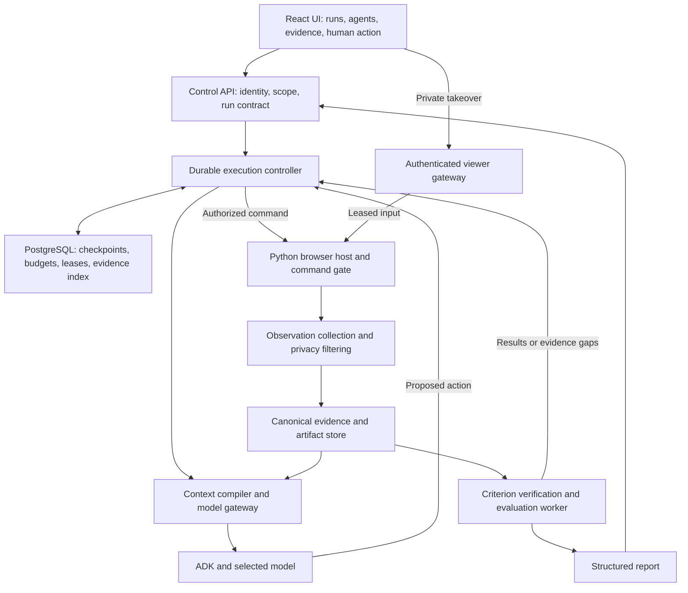

# MarketTwin: unified architecture for cost, quality, and human assistance

Date: 20 September 2026. Status: proposed implementation architecture, grounded in the local branch audit and research prototypes. This document supplements the existing `architecture.md`; it does not silently replace that implementation contract or enable production features.

## Decision

Keep the existing React/TypeScript UI, Python control API, ADK orchestration, Python Playwright controller, evaluation worker, PostgreSQL, and object storage. Add one application-owned execution controller coordinating context construction, budgets, evidence, and human handoff. Retain one authority for browser commands.

Make the browser host independently long-lived so pausing or restarting a model invocation does not destroy its session. Implement context compilation, budget accounting, and escalation initially as ordinary Python modules, not additional LLM agents or separate network services.

The objective is the lowest measured total cost that satisfies the study's coverage, evidence, defect-detection, and persona requirements. There is no established globally optimal architecture or universal zero-regression guarantee. This design creates the boundaries needed to measure and enforce the requirements.

## Proposed structure



The browser host checks commands at execution time; the diagram's controller-side authorization is not the only enforcement. A verifier needing more evidence requests it through the controller instead of creating a competing browser session or input path. Private takeover disables ordinary evidence collection before the private stream is available.

## 1. Pin the study contract before running

The contract records study mode, required personas and assignments, mission criteria, permitted targets and dependencies, model/prompt versions, action policy, budgets, verification requirements, and human-assistance policy. Hash/version the contract and preserve it with results.

Support distinct modes:

| Mode | Permitted efficiency measures | Coverage rule |
|---|---|---|
| Functional/regression check | Reuse an approved procedure and deterministic assertions; recollect current evidence | Execute the scenarios/variants needed by the explicit contract |
| Persona/usability study | Compact observations and remove redundant history while preserving discoverability, reading/spatial order and relevant uncertainty | Preserve required personas and assignments; do not inject hidden routes or evaluator answers |

Replace the unconditional persona × mission expansion with explicit assignments that satisfy the contract. A narrow factual heading check need not become nine journeys. If three personas are required, keep all three. Scope reduction and per-journey efficiency must appear as separate savings in comparisons.

Planner output is validated once against this contract. Do not add an expensive planning agent to every browser step.

## 2. Execution controller: one decision point

The controller selects the next operation from observed state, unresolved criteria, failures, remaining budget and study mode:

| Condition | Operation |
|---|---|
| Required results already have sufficient verified evidence | Finalize |
| Evidence is incomplete or was truncated | Expand observation or retrieve relevant evidence |
| An approved deterministic procedure has satisfied preconditions | Execute and verify |
| Evidence is adequate but a decision needs reasoning | Compile bounded context and call the model |
| Adequate evidence repeatedly produces invalid decisions | Consider a stronger model within the shared budget |
| User intent or a user-only fact is missing | Ask a structured clarification |
| Private authentication or interactive assistance is required | Persist a handoff and suspend agent execution |
| An action requires scoped approval | Request approval bound to the actual action |
| Action is disallowed | Stop or choose a permitted alternative |
| Repetition, recovery or budget limits are reached | Finish with unresolved criteria or request appropriate assistance |

Run policy, state validation, loop detection and budgeting in code. A model proposes an action; it cannot grant itself scope, bypass a lease, increase its budget or declare evidence sufficient merely by saying so.

Each command carries at least `command_id`, run/journey/browser identity, browser generation, control epoch, expected scene version, typed action/target and relevant policy/approval version. Inside the browser's execution gate, revalidate ownership, scene/target, policy and idempotency before performing it. Reject stale commands. A stale scene causes fresh observation rather than an automatic guessed retry.

## 3. Evidence collection precedes context reduction

Build an authorized canonical observation independently of the small model payload. Include observed text blocks, controls, labels, frame identity, relevant shadow-root content, geometry, visibility, alerts/dialogs, errors, provenance and explicit completeness/omission metadata. Identify page/scene versions and timestamps. Lazy content or inaccessible regions must remain known gaps; do not call an inventory universally complete.

The current positional element cap and ARIA truncation can hide visible headings, billing conditions and overlays. Fix those blind spots before enabling relevance pruning. Add targeted region/frame retrieval so large pages do not require sending everything to the model.

Store sanitized structured observations and evidence references in PostgreSQL/object storage, with restricted access and retention. Deduplicate immutable blobs by content hash while preserving separate capture timestamps, attribution and provenance. Do not reuse an old observation as evidence of a fresh current state. Do not store private takeover input in this evidence path.

Screenshots support pixels; DOM/accessibility data supports semantic and structural facts. A DOM element with an in-viewport bounding box cannot by itself prove readable, unclipped, unobscured pixels. Required visual criteria retain current visual verification, including surrounding viewport context when a crop alone is insufficient.

## 4. Context compiler: small requests with recoverable evidence

For each decision, assemble:

```text
Versioned instructions and necessary tool schemas
Persona, mission, literal criteria and applicable policy
Compact progress ledger with failures and unresolved criteria
Current scene information required for the decision
Necessary recent tool calls and corresponding results
```

Use this rollout order:

1. Reversible compact encoding, with a whole-request size guard that falls back when encoding is larger.
2. Mask expired/repeated historical observations after retaining their relevant facts, failures and evidence references.
3. Add criterion-aware selection with dependency bundles and bounded retrieval/expansion.
4. Evaluate learned compression only if its net cost and quality beat the simpler implementation.

Keep price/currency/billing period/conditions together. Preserve negations, target identities, known contradictions, failed actions and literal criteria. Maintain a discovery allowance for unexpected alerts or defects that do not match the mission's keywords. Preserve persona-visible boundaries; evaluator-only knowledge cannot leak into persona context.

For deltas, include the retained base version; refresh the snapshot after navigation or lost synchronization. Retain valid provider tool-call/result pairing. Instrument the final assembled request, not just intermediate dictionaries. An ADK history flag alone did not bound the current invocation's tool history in the installed-version probe.

The reference selector is a heuristic for a proxy objective. Its offline counterexamples show why it cannot be the quality authority. Missing or uncertain evidence triggers expansion; it never becomes a pass because the selected subset looks consistent.

## 5. Shared model gateway and budget ledger

Route planner, persona, verifier and optional compressor calls through the same accounting boundary. Record request/attempt IDs, role, model version, final request size estimate, provider-returned usage, cached-input accounting, output/reasoning fields, latency, retries and known/unknown cost. Do not double-count overlapping usage fields or streaming updates.

Reserve capacity for required verification before optional exploration. Enforce per-call and per-run limits on calls, actions, retries, context, output and duration. With concurrent workers, reservations must be atomic so they cannot all spend the same remaining budget. Estimated dollar caps need allowance for in-flight requests and uncertain usage; report reconciliation honestly rather than promising an exact hard cap without provider support.

Schedule requests against the provider/model's applicable shared rate-limit scope. Bound retries, respect retry guidance and avoid retry storms. Keep run budgets and rate limiting separate: TPM exhaustion is not total billed spend.

Version stable prompt/tool prefixes for caching where supported. Caching may lower billed input cost but does not justify unnecessary context. Do not begin by switching every agent to a cheaper model: reduced model capability must pass the same quality evaluation. Required verification can use a stronger model when the criterion needs it, with its cost included in the run.

## 6. Durable human handoff using the same browser

Separate three interactions: clarification, scoped action approval and private takeover. Persist waiting as an intentional state. Human wait time has a separate deadline from active agent execution, and does not invoke the model repeatedly.

```text
running -> pausing -> waiting_for_human -> human_control -> verifying_resume -> running
                                ^              |                  |
                                +-- expiry ----+-- failed check --+
```

Pause intent stops new admissions; already executing operations must drain or have their outcomes reconciled. Grant one authenticated owner a temporary lease. Enforce expiry and the current control epoch at the actual input boundary for every command, including viewer input. Revoke old display/input access after lease termination. A browser refresh or duplicate completion request must not create a second resume.

The private viewer connects to the exact retained browser. For hosted V1, use isolated headed Chromium with noVNC through an authenticated gateway. noVNC's client `viewOnly` setting is not an authorization boundary; the server must enforce control. This follows the [noVNC API](https://novnc.com/noVNC/docs/API.html) capabilities plus application-specific gateway design.

Disable stored captures, traces and sensitive telemetry during private takeover, including buffered data that could be flushed afterward. After Done, revoke input, verify the expected account/tenant/page state, check capture readiness, then resume with a new epoch and minimal safe facts. Done itself is not proof of success.

Persist checkpoint state independently of the live browser host. A surviving host can be reattached after validating identity/generation. If the browser is lost, record context loss and start an explicit new attempt if appropriate; database state cannot restore arbitrary live JavaScript state.

Keep ADK as the reasoning framework while owning the durable application workflow. Current [ADK confirmation documentation](https://adk.dev/tools-custom/confirmation/) lists database-session limitations, and [ADK resume](https://adk.dev/runtime/resume/) warns that tools may execute more than once. Validate the adapter with the installed version and preserve invocation/tool-call IDs; do not assume a confirmation flag solves browser retention, authorization or replay.

## 7. Quality verification and report integrity

Maintain two independent dimensions for every criterion:

- Verdict: pending, pass, fail or unresolved.
- Execution provenance: autonomous, assisted, or precondition established by a human.

Track evidence completeness independently as well. An assisted criterion may genuinely pass, but must not inflate autonomous success. If login itself is under test, human completion is intervention evidence. If login is only setup for a billing-page test, record it as a prerequisite and evaluate the downstream behavior separately.

Use deterministic verification for facts it can establish, and targeted semantic/visual verification where needed. The evaluator reads canonical authorized evidence, not only the persona's compressed context or conclusion. This separation reduces shared omission risk; it does not automatically make an LLM judge correct. Missing evidence returns a specific gap to the controller. Contradictory observations stay visible.

Generate the report from structured findings and evidence IDs. Add narrative explanation only where useful; avoid sending an entire run transcript to another model for every report. Existing deterministic reporting should remain the base.

## 8. Website access and payments

Preserve target authorization and network boundaries. Extend approved dependency configuration for identity providers, APIs, frames and required resources. Add explicit frame/tab identity to grounding, handle open shadow DOM, and request visual evidence for canvas content when text extraction cannot observe it. Verify popups and redirects without granting arbitrary origins.

Human assistance improves reach, but does not guarantee access to every site or device-bound authentication flow. Report unsupported cases explicitly.

Keep public-price inspection, authorized account-billing inspection and sandbox checkout as separate task policies. Private login does not grant purchase authority. Site content cannot authorize changes to the run's policy. The quality system must preserve exact monetary conditions and environment identity when judging payment-related criteria.

## 9. Deployment and repository changes

These are module boundaries first; separate them into services only where lifetime, isolation or scaling requires it.

| Existing location | Proposed work |
|---|---|
| `services/execution-orchestrator/.../workflow` | Durable execution outcomes/checkpoints, next-operation rules, budget reservations, loop detection and pause/resume adapter |
| `services/execution-orchestrator/.../browser` | Ownership checks under lock, control epochs, scene validation, richer collector, privacy enforcement and independently retained browser-host lifecycle |
| `services/execution-orchestrator/.../persistence` | Canonical observations, progress ledger, usage attempts and checkpoint writes |
| New orchestrator `context` and model-gateway modules | Request assembly, reversible encoding, masking, evidence retrieval and shared accounting |
| `packages/database-python` | Migrations for paused states, browser generation/control, lease uniqueness, request phases, usage/reservations and provenance |
| `services/control-api` | Authorized handoff claim/answer/complete/cancel operations, viewer admission and run telemetry |
| `services/evaluation-worker` | Evidence sufficiency checks, targeted verification, explicit unresolved results and assistance attribution |
| `apps/web` | Agents, usage, human-action, evidence and result views |

Keep one Python browser authority. Do not revive a separate competing Node browser controller just to obtain a viewer. Browser-host separation is a process/lifetime decision, not a requirement for a different language.

Use PostgreSQL as durable truth; use the existing job transport plus an outbox/reconciliation mechanism for reliable scheduling. Do not add another workflow platform merely to implement a pause. Isolate journey browsers and apply resource/retention quotas. Begin with conservative concurrency; scale only after measuring memory, provider limits and active-session costs.

The UI should show effective prompts and versions, enabled tools, assigned missions, current state, actions, evidence and usage per agent. Secret values are always redacted. Human action should show reason, scope, owner, expiry and verification outcome. Display autonomous and assisted metrics separately.

## 10. Build order and acceptance gates

| Phase | Deliverable | Required evidence before progressing |
|---|---|---|
| 1. Baseline and correctness | Usage instrumentation; collector coverage fixes; controller race and capture fixes; explicit study assignments | Labeled fixtures expose and then prevent the known omissions/race; all model roles accounted for |
| 2. Conservative token reduction | Canonical persistence, guarded compact encoding, progress ledger/history masking, repetition limits and shared budgets | Matched real-model runs show lower total cost without observed critical quality/coverage regressions |
| 3. Complete human lifecycle | Migrations, single-owner handoff, retained browser, private viewer, verified resume and ADK adapter | PostgreSQL concurrency, stale input, duplicate events, expiry, private-capture and process-recovery checks; controlled real-user flow |
| 4. Evidence-driven evaluation and UI | Criterion evidence gate, targeted visual checks, assistance attribution and transparent usage | Seeded defects detected; unsupported passes rejected; evidence and actor attribution reviewable |
| 5. Adaptive optimization | Budgeted lossy selection, model routing and eventually calibrated escalation | Ablations on held-out sites/tasks beat Phase 2–4 cost while meeting the same quality contract |

Quality checks start in Phase 1; Phase 4 completes their product integration. Phases 2 and 3 can be implemented independently after shared evidence and ownership contracts stabilize. Do not enable private production takeover before all Phase 3 lifecycle checks pass.

Compare identical assignments and model configurations first. Measure defect recall, false passes, unsupported findings, completion, persona fidelity, evidence completeness, assistance and human minutes, as well as median/tail cost and latency. Count unresolved and failed attempts in denominators. Introduce one optimization at a time, retain feature flags and rollback, and use independently labeled ground truth because the current baseline has known blind spots.

## Existing evidence and remaining uncertainty

The dense-fixture reversible encoding reduced tool-text tokenization from 5,830 to 3,395; the four-request mock-ADK serialized payload fell about 35%. These are local serialization measurements, not provider bills or proof of equal model performance. A tiny payload grew without the guard. The selector missed a critical unlabeled qualifier and did not always find the proxy optimum. Accordingly, aggressive selection remains experimental.

The handoff prototype passed 19 tests and retained the same browser context through a scripted local login. It reproduced a race in the current controller. It did not test production viewer authorization, real SSO/MFA, database races or deployed recovery.

Sources and reproducible artifacts: [token algorithm](token-efficiency/ALGORITHM.md), [adversarial validation](token-efficiency/VALIDATION.md), [website-access audit](website-access/RESEARCH.md), and [human-assistance research](human-in-the-loop/RESEARCH.md).

The architecture proposal is complete. Its components must now be implemented and evaluated; no end-to-end savings percentage or universal quality guarantee is established by the existing prototypes.
