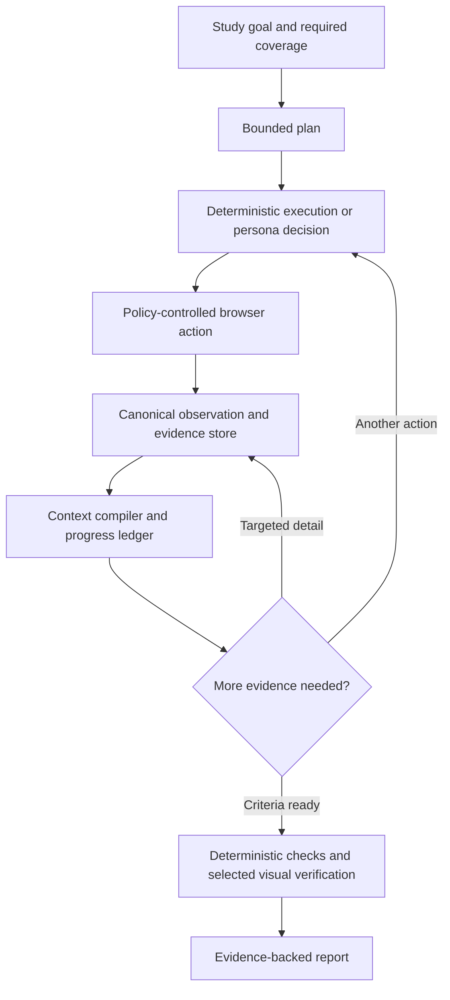

# MarketTwin token efficiency: research, code audit, and proposed design

Research date: September 20, 2026. Audited local branch: `refactor/python-browser-controller`, commit `2c2b00c006d0f8947c28d9d68bccf8408e39ca66`. Application source was unchanged during this research. No paid model requests or live TestRuns were executed.

Follow-up: [the concrete algorithm specification and offline selector](ALGORITHM.md) combines the research into explicit selection, execution, recovery, and validation rules.

Validation follow-up: [actual local-browser and ADK samples](VALIDATION.md) reproduced evidence omissions in the current collector and tested reversible request encoding. This narrows the rollout recommendation: establish capture quality and reversible savings before enabling lossy selection.

**MarketTwin has substantial opportunities to reduce unnecessary inference. The strongest approach is to reduce redundant work and maintain compact, recoverable state, then select models using measured cost per correct result.** A generic prompt compressor is a later option. Preserving output quality requires checking defect detection, evidence correctness, and persona behavior—not merely whether the agent finishes its mission.

This investigation combines the supplied conversation and pasted answer, the local application and installed ADK implementation, primary research, and current provider documentation. It is a broad targeted review, not a claim to have read every paper on efficiency. Methods/results/limitations were inspected in full-text sources for the most relevant compression studies; other entries below are explicitly screening-level evidence from author abstracts or project pages. Published benchmark gains are not MarketTwin measurements.

The recommendation is to build a small context-and-execution layer within the existing Python boundary. Keep ADK, Playwright, the deterministic policy boundary, and evidence storage. The architecture already contains useful foundations; it needs better control of what becomes model context and when a model is called.

**The source code identifies concrete waste, but does not yet identify the actual bill.**

| Finding | Evidence in the audited checkout | Implication |
|---|---|---|
| Three personas are mandatory | [plan.py](C:/Users/sreen/OneDrive/Desktop/MarketTwin/services/execution-orchestrator/src/markettwin_execution_orchestrator/agents/schemas/plan.py:26); Meta Agent also requests exactly three | Even a single factual check pays for multiple perspectives unless the product contract changes. |
| Every persona executes every mission | [journey_planner.py](C:/Users/sreen/OneDrive/Desktop/MarketTwin/services/execution-orchestrator/src/markettwin_execution_orchestrator/workflow/journey_planner.py:24), independently repeated in [plan_repository.py](C:/Users/sreen/OneDrive/Desktop/MarketTwin/services/execution-orchestrator/src/markettwin_execution_orchestrator/persistence/plan_repository.py:168) | Three personas and three missions produce nine independent trajectories. Changing only the planner would leave persistence inconsistent. |
| Journeys execute sequentially | [multi_persona_executor.py](C:/Users/sreen/OneDrive/Desktop/MarketTwin/services/execution-orchestrator/src/markettwin_execution_orchestrator/workflow/multi_persona_executor.py:65) | Do not attribute this implementation's burst to parallel persona execution. Sequential calls can still exceed a rolling TPM limit. |
| Observations include up to 80 elements | [observations.py](C:/Users/sreen/OneDrive/Desktop/MarketTwin/services/execution-orchestrator/src/markettwin_execution_orchestrator/browser/observations.py:13) | Elements contain repeated dictionary keys, boxes, tags, booleans, and null levels. Selection is positional, not task-aware. |
| ARIA is additional, not a substitute | [contracts.py](C:/Users/sreen/OneDrive/Desktop/MarketTwin/services/execution-orchestrator/src/markettwin_execution_orchestrator/browser/contracts.py:107) | `asdict` emits the observation; only ARIA is capped, at 2,000 characters. Characters are not tokens. Error arrays have no explicit model token cap here. |
| Every successful tool returns that observation | [tools.py](C:/Users/sreen/OneDrive/Desktop/MarketTwin/services/execution-orchestrator/src/markettwin_execution_orchestrator/browser/tools.py:122) | Fill, click, wait, screenshot, and get-state can repeatedly contribute similar state. |
| The persona uses ADK's default history behavior | [persona_agents.py](C:/Users/sreen/OneDrive/Desktop/MarketTwin/services/execution-orchestrator/src/markettwin_execution_orchestrator/agents/persona_agents.py:168) | There is no application callback compiling a bounded request, and no configured compaction in the inspected execution path. |
| Execution primarily limits elapsed time | [journey_executor.py](C:/Users/sreen/OneDrive/Desktop/MarketTwin/services/execution-orchestrator/src/markettwin_execution_orchestrator/workflow/journey_executor.py:180) | Default is 180 seconds. No explicit small `RunConfig.max_llm_calls` or input-token/dollar budget is passed here. Installed ADK defaults to 500 calls. |
| A separate limits dataclass is not this path's enforcement | [state.py](C:/Users/sreen/OneDrive/Desktop/MarketTwin/services/execution-orchestrator/src/markettwin_execution_orchestrator/workflow/state.py:20) | `max_steps=10` existing elsewhere does not establish a ten-step limit for persona journeys. |
| Output limits are already small | [model_factory.py](C:/Users/sreen/OneDrive/Desktop/MarketTwin/services/execution-orchestrator/src/markettwin_execution_orchestrator/models/model_factory.py:8) | Default persona model is `openai/gpt-4o-mini`, output cap 512, configured retries 2. Planner output cap is 1,024. Cutting these again is not the first intervention. Environment overrides were not inspected. |
| Usage exists in the adapter but is not persisted by these workflows | [journey_executor.py](C:/Users/sreen/OneDrive/Desktop/MarketTwin/services/execution-orchestrator/src/markettwin_execution_orchestrator/workflow/journey_executor.py:181), planning event loop, visual verifier | They extract final text/results. Installed LiteLLM adapter maps input, output, cached input, total, and reasoning usage into ADK metadata. |
| Vision is gated, but still potentially expensive | [visual_verifier.py](C:/Users/sreen/OneDrive/Desktop/MarketTwin/services/evaluation-worker/src/markettwin_evaluation_worker/visual_verifier.py:22) | Defaults to `gpt-4o-mini`; sends viewport plus optional crop, with no explicit image detail; output cap 300. Batch evaluator invokes it per criterion with explicit visual evidence. |
| Reporting is already deterministic | [report_generator.py](C:/Users/sreen/OneDrive/Desktop/MarketTwin/services/evaluation-worker/src/markettwin_evaluation_worker/report_generator.py:278) | Do not propose an LLM report-writer as a prerequisite or count imaginary report-generation tokens. |

Full accessibility snapshots and screenshots are saved as artifacts, with session logs/traces handled separately. However, the inspected step recorder does not save a full structured copy of every model-visible observation. Before discarding old context, persist that canonical observation too. “Everything is already stored” is stronger than the code supports.

The reported 200,000 TPM rejection is a throughput observation, not a run-level invoice. It cannot establish that a run cost exactly 200,000 tokens, or that all counted traffic belonged to this run. The logged requested-token estimate also does not prove the visual request would bill only about 1,000 tokens. Reconstruct attribution from provider usage and application call records.

For scale only: at the documented standard `gpt-4o-mini` input rate of $0.15 per million, 200,000 uncached input tokens would be $0.03, before output and other charges. This is not an estimate of the user's bill; the active model, total traffic, images, successful retries, and repeated runs remain unknown. If actual charges are much higher, checking attribution is essential. [Official model pricing](https://developers.openai.com/api/docs/models/gpt-4o-mini).

**An offline experiment establishes that the representation itself can be materially smaller.**

I used the actual `BrowserObservation` and `BrowserActionResult` serializers with a synthetic 80-element scene, approximately 2,000 ARIA characters, short labels, and a 1280×900 viewport. The script uses the locally bundled `o200k_base` tokenizer and explicitly rejects tokenizer downloads. It does not initialize the application or call a model.

| Representation | Text tokens | Change from current serialization | What was preserved |
|---|---:|---:|---|
| Current dictionary representation | 5,529 | Baseline | Current model-facing payload |
| Same payload, minified JSON | 4,140 | −25.1% | All payload values |
| Column names once, then rows for all 80 elements | 3,081 | −44.3% | All element fields and remaining payload; element round-trip checked |
| Twenty rows, no ARIA, explicit omission count | 751 | −86.4% | Deliberately incomplete candidate, not quality-equivalent |

These numbers cover the serialized tool-result text only. They exclude system prompts, tool definitions, message framing, output, and image tokens. They are not observations of the Wikipedia run. The 44% result is information-preserving for this fixture, but even a reversible format can affect a model's ability to interpret it. Model behavior must still be evaluated. The 86% figure demonstrates the available size range, not a deployable saving.

Reproduction: [offline_probe.py](C:/Users/sreen/OneDrive/Desktop/MarketTwin/docs/research/token-efficiency/offline_probe.py). Output: [offline-probe-results.json](C:/Users/sreen/OneDrive/Desktop/MarketTwin/docs/research/token-efficiency/offline-probe-results.json).

Simply removing whitespace from application objects will not necessarily change requests: the installed adapter serializes tool-result objects again. Inspect the final provider-bound body. An explicit row schema is a more reliable representation change than assuming an earlier `json.dumps` controls the final wire format.

**The research supports several complementary mechanisms, with important limits on their applicability.**

“Full text” below means relevant method/results/limitations were inspected; it does not mean every appendix was reproduced. “Screened” means author abstract, publication page, or project result was checked. Numerical claims remain the authors' results on their evaluated settings.

| Research and reading depth | What the evidence actually supports | MarketTwin decision |
|---|---|---|
| [Mind2Web, 2023](https://arxiv.org/abs/2306.06070), screened | Real-world HTML benefits from candidate filtering before action generation. Offline action benchmarks are not complete usability evaluations. | Borrow candidate selection; do not equate element accuracy with defect recall. |
| [WebLINX, 2024](https://arxiv.org/abs/2402.05930), screened | Retrieval-inspired element selection helps fit conversational web navigation into limited contexts. | Rank and expand scene content; retain dialogue/task progress. |
| [Prune4Web, AAAI 2026](https://arxiv.org/html/2511.21398v1), full text | LLM-generated scoring programs reduce grounding candidates 25–50×. This is candidate reduction, not a 25–50× bill reduction. Planning and weak DOM semantics remain limitations. | Use bounded programmatic filtering. Start with controlled Python heuristics rather than unrestricted generated pruning code. |
| [Lost in the Middle, TACL 2024](https://aclanthology.org/2024.tacl-1.9/), screened | Relevant information position affected long-context performance in the studied models/tasks. | Keep current state and essential progress easy to find; this does not prove all short contexts outperform long contexts. |
| [LLMLingua, 2023](https://arxiv.org/abs/2310.05736), screened | Up to 20× prompt compression with limited loss on selected datasets. | Useful research lineage; that maximum does not transfer automatically to selectors, numbers, or browser state. |
| [LongLLMLingua, 2024](https://arxiv.org/abs/2310.06839), screened | Query-aware reduction can improve answer quality with fewer tokens; about 4× fewer tokens in a reported NaturalQuestions setting. | Consider for large retrieved product documents, after extracting relevant sections. |
| [LLMLingua-2, 2024](https://arxiv.org/html/2403.12968v2), full text | A trained token classifier achieves reported 2–5× compression and 1.6–2.9× end-to-end speedups; training data originate in meeting transcripts, with additional out-of-domain evaluations. | Benchmark later on unstructured prose. Preserve literal criteria, negations, amounts, and identifiers separately. |
| [Characterizing Prompt Compression, 2024](https://arxiv.org/html/2407.08892v1), full text | Reranking/extractive methods often outperform token pruning or generic summarization on the tested long-context tasks; up to 10× compression at some operating points. | Establish extraction/ranking as a baseline before deploying a learned compressor. |
| [Fundamental Limits of Prompt Compression, 2024](https://arxiv.org/abs/2407.15504), screened | Formalizes a rate–distortion trade-off; query-aware selection matters in synthetic and small natural-language experiments. | Optimize task-specific information preservation, not compression ratio alone. |
| [Prompt Compression Survey, NAACL 2025](https://aclanthology.org/2025.naacl-long.368/), screened | Separates textual hard compression from learned soft representations. | Distinguish API-compatible transformations from methods requiring model internals. |
| [Concise and Precise Context Compression for Tool-Using LMs, 2024](https://arxiv.org/html/2407.02043v1), full text | Up to 16× tool-documentation compression in its experiments uses jointly trained compressor/decoder and soft representations, preserving key identifiers. | The identifier-preservation principle transfers. The 16× result is not a drop-in OpenAI prompt-shortening technique. |
| [ACON, 2025 / workshop 2026](https://arxiv.org/html/2510.00615v2), full text | Joint observation/history compression reduces peak tokens 26–54% in tested environments. Its cost analysis explicitly warns that history compression can raise API cost through compressor overhead and lost cache reuse. | Prioritize observation reduction; measure dollars as well as peak tokens; avoid summarizing every turn. |
| [AgentFold, 2025 / ICLR 2026](https://arxiv.org/abs/2510.24699), screened | Learns context consolidation at multiple scales for long-horizon web information seeking. | Borrow recoverable, selective memory. Learned agent results are not evidence that a generic rolling summary is sufficient. |
| [Less Context, Better Agents, June 2026](https://arxiv.org/html/2606.10209v1), full text | In its 50-task expense benchmark, full history used 1.481M tokens with 71% completion; recent history plus summary used 553K with 91.6%. Results were averaged across five runs. | Strong motivation for recent state plus progress memory; ERP expense itemization is not MarketTwin's target distribution. |
| [DEPO, AAAI 2026](https://opencausalab.github.io/DEPO/), screened | Preference optimization jointly targets step and trajectory efficiency; reported maxima include 60.9% fewer tokens and 26.9% fewer steps on WebShop/BabyAI. | Measure both dimensions now. Fine-tuning is a later investment. |
| [BAGEN, 2026](https://arxiv.org/abs/2606.00198), screened | Budget awareness is imperfect; reported early stopping saves 28–64% of tokens on failed trajectories, not all traffic. | Enforce host-side budgets and recovery limits. Model confidence alone must not decide whether a product passed. |
| [Plan and Budget, 2025 / ICLR 2026](https://arxiv.org/abs/2505.16122), screened | Adaptive reasoning allocation addresses over- and underthinking; reported up to 39% token reduction in reasoning tasks. | Allocate by mission complexity. Do not add a planning model call to every trivial click. |
| [RouteLLM, 2024/2025](https://arxiv.org/abs/2406.18665), screened | Strong/weak routing reduces cost by over 2× in some evaluated settings. | Benchmark role-specific models and escalation, including extra retries and failed runs. |
| [SWE-Pruner, 2026](https://arxiv.org/abs/2601.16746), screened | Task-conditioned line selection reports 23–54% token reductions on coding-agent tasks. | Supports preserving meaningful structure; coding-line results do not directly validate DOM pruning. |
| [500xCompressor, 2024/ACL 2025](https://arxiv.org/abs/2408.03094), screened | Learned representations achieve extreme ratios, with reported retained capability only 62–73% in the abstract's comparisons. | Poor fit for a strict quality-preservation requirement and a hosted black-box API. |
| [AQuaUI, May 2026](https://arxiv.org/abs/2605.19260), screened | Adaptive quadtree merging reduces internal visual tokens while retaining important regions. | Relevant if hosting a compatible vision model. Not equivalent to shrinking PNG file bytes. |
| [GUIPruner, February 2026](https://arxiv.org/abs/2602.23235), screened | Preserving spatial structure and treating old screenshots differently helps visual-agent compression. | Preserve coordinates and current fine detail; internal token pruning is not an exposed generic API feature. |
| [SkillLens, August 2026](https://arxiv.org/abs/2608.10775), screened | Retrieves procedures with applicability cues, visual evidence, and verification signals. | Useful direction for verified skill reuse; evaluate generalization and mistaken reuse. |
| [Efficient GUI Agents systems survey, September 2026](https://arxiv.org/html/2609.02309v1), full text | Organizes observation, memory, actions, and runtime efficiency, including hidden parser/verifier overhead. It is a recent preprint, not an independent validation of every surveyed result. | Supports an end-to-end cost/quality evaluation rather than choosing one compression metric. |

The studies consistently motivate selective context and fewer unnecessary decisions. They do not establish that arbitrary pruning is lossless, that savings multiply independently, or that token reductions imply equivalent dollar reductions across models.

**The highest-value architectural change is to separate the evidence store from the next-decision input.**

Use three representations with explicit ownership:

1. The evidence store contains canonical observations, screenshots, accessibility data, logs, action arguments/results, and immutable step/artifact identifiers. This is the audit record.
2. Runtime state contains current scene, allowed actions, progress, unresolved criteria, failed attempts, and remaining resources. The controller updates observed facts; model proposals remain labeled as proposals until verified.
3. The model input contains a projection of that state, recent necessary interactions, and references through which omitted evidence can be recovered.

This is a practical combination of established ideas. The name “Evidence-Aware Context Compiler” is useful internally, but does not itself establish scientific novelty.

A compiled request should contain the stable policy and tool contract, the persona's actual knowledge, the current goal, criterion references where appropriate, a compact current scene, progress facts with evidence IDs, and a small recovery history. It should not reconstruct its state from every old DOM observation.

A starting experiment could target a 1,000–2,000-token observation and 2–4 recent complete action/result pairs, with a small ledger. These are tuning candidates, not fixed universal limits. Overall request size also includes instructions and schemas. Preserve larger state when the task demonstrably requires it.

A fact record needs provenance and scope: `fact`, `source_step`, `state_version`, `valid_until`, and `confidence_basis`. “Checkbox selected at step 7” is a scoped observation; “mission passed” is an adjudicated result. Navigation or a relevant state change should invalidate stale facts.

Use exact criterion IDs instead of regenerating long criteria strings in every action response. Keep the full criterion definition pinned once, then validate IDs and hydrate the final human report in code. Never remove the identity of which criterion was assessed, its uncertainty, or its supporting evidence.

**Compact observations need a coverage contract, not just a smaller element cap.**

Start with reversible serialization: shared column labels, fewer redundant representations, short artifact references, omission of fields whose defaults are explicitly defined, and exact state identifiers. Preserve distinguishable elements, accessible names, boxes when needed, and meaningful values.

Then add a mode-aware ranker. Always reserve space for page identity, navigation context, dialogs, alerts, blockers, validation feedback, and changed controls. Add the active form's context, relevant content, and requested evidence. An observation must announce whether it was filtered, how much was omitted, and how to expand it.

Do not simply delete ARIA. The current element extractor focuses on controls, headings, role-bearing nodes, and certain other elements; ordinary paragraphs, price spans, and explanatory text may only be represented in accessibility content. Removing that representation without replacing its unique information can damage pricing, comprehension, and usability tests. Also preserve useful control state such as selected/checked/expanded/value/error relationships as the canonical observation evolves.

Expose bounded expansion operations such as “show this region,” “show additional visible elements,” “show text around this control,” and “retrieve the evidence for criterion C2.” Expansion must respect the persona's visibility and knowledge constraints. A novice persona should not silently gain an omniscient off-screen DOM search that a human user could not perform.

Add scene versions and scoped element handles. Revalidate a handle before clicking; reject stale references after navigation or relevant mutation. The current role/name mechanism has ambiguity when labels repeat, and truncated names may fail exact matching. Addressing grounding failures can save more total tokens than shortening the labels further.

Deltas are appropriate between the browser and host state manager. The host must maintain a materialized latest scene. After history eviction, the model cannot apply “element 7 changed” unless it still has the applicable base. Prefer a fresh compact current scene in each decision request; use a delta only when its base is guaranteed present. Periodically refresh after navigation, dialogs, or large changes.

**Reducing work must preserve what the study is trying to measure.**

| Study mode | Valid optimization | What would invalidate the study |
|---|---|---|
| Factual regression: verify a known heading/layout | One relevant browser configuration, deterministic navigation and checks, targeted vision, reusable action procedure | Skipping a requested browser/viewport variant or treating ARIA presence as visual readability |
| Persona usability: can a novice find the page? | Compact observations, bounded memory, reliable tool execution, independent persona evidence | Giving the novice a cached successful route or hidden target locator, eliminating genuine hesitation, or conflating multiple personas into one |
| Repeat regression of an established flow | Replay verified steps with fresh preconditions and postconditions; invoke LLM on drift | Reusing yesterday's pass/fail verdict instead of executing today's test |

Three perspectives are not automatically required for one factual assertion. Conversely, nine journeys are not automatically redundant if they cover distinct behavior or conditions. Replace the Cartesian product with an explicit coverage matrix: each required criterion × meaningful persona/environment condition maps to at least one journey, with rationale for additional journeys. Fewer journeys must be reported as changed coverage, not concealed as the same experiment.

For the Wikipedia goal, separate “reach the correct page” from “heading exists,” “heading is fully in the viewport,” and “heading is visually readable without overlap.” Those may be checks within one journey rather than independent missions. If discovery from the homepage is part of the study, retain it. If the task is only a known-page regression, a direct validated route may suffice.

Navigation to the supplied starting URL is a deterministic instruction already embedded in the runtime prompt. Executing it in the host before the first model call can save a decision, provided its resulting observation and evidence are supplied and navigation failure is handled normally.

Reuse the post-action observation instead of asking the model to issue an immediate redundant `get_state`. For failures, have the tool return a safe current observation when possible, avoiding a guaranteed recovery round trip. Use bounded host-side readiness checks for expected loading states. Preserve the observed wait and friction in the study record.

For stable regression flows, compile successful actions into a versioned procedure containing applicability conditions, semantic targets, allowed parameters, expected outcomes, and drift checks. Browserbase's documented action cache similarly reuses resolved actions only when state/request fingerprints match. That engineering pattern is applicable; its reported speedups are not MarketTwin estimates. [Stagehand caching](https://dev.browserbase.com/blog/stagehand-caching).

Use guarded action groups only where the next action is already justified. Stop a group on unexpected navigation, validation, dialog, or policy condition. Record each constituent browser action. Arbitrary long click batches can cross a stale state boundary and hide defects. Programmatic filtering/loops can keep intermediate data outside model context, as described in [Anthropic's code-execution design](https://www.anthropic.com/engineering/code-execution-with-mcp); MarketTwin already has ten concise tools, so huge tool-library savings from other systems should not be assumed here.

**ADK can support the design, but a configuration-only fix is insufficient.**

The lockfile pins ADK 2.5.0 and LiteLLM 1.93.0. Installed code confirms default history inclusion, usage mapping, before-model callbacks, and a token-threshold compaction request processor. These local details matter more than copying examples for a newer release.

In particular, `include_contents='none'` retains the current user turn's tool interactions. MarketTwin puts a complete journey inside one user-initiated `run_async` invocation. Consequently, setting that flag alone does not remove the growing sequence inside that journey. See [_get_current_turn_contents](C:/Users/sreen/OneDrive/Desktop/MarketTwin/.venv/Lib/site-packages/google/adk/flows/llm_flows/contents.py:863).

Sliding-window compaction counts user-initiated invocations in the installed configuration, rather than meaning “keep only the last three browser actions.” Token-triggered behavior is a separate mechanism. The installed `EventsCompactionConfig` also still requires `compaction_interval` and `overlap_size`; the current online token-only example should not be pasted without a version check. [ADK compaction documentation](https://adk.dev/context/compaction/).

The preferred first implementation is an application-owned compiler at the before-model boundary. Preserve system instructions, the current task, pending calls, tool-call IDs, and complete call/response groups. Never slice a list of messages blindly. ADK has provider-specific pairing and compaction logic for a reason. Leave canonical session/audit history intact and operate on the request projection.

Verify the actual request after the LiteLLM adapter: it is possible to add a compact ledger while accidentally leaving the entire old history alongside it. Unit-level payload checks should prove old snapshots are absent and every retained response still has its matching call. Native compaction can be a fallback for complex long histories; include its model cost in accounting.

**Vision deserves an early, separate cost/quality benchmark.**

The present separation of semantic actions and explicit pixel verification is valuable. Keep it. However, the default vision model's billing formula is a major caveat: the official table assigns `gpt-4o-mini` 2,833 base tokens and 5,667 per image tile, compared with 85 and 170 for `gpt-4o`/`gpt-4.1`. A hypothetical six-tile image therefore represents 36,835 image tokens on the former versus 1,105 on the latter. These are image tokens, not a measurement of this run or a direct dollar comparison. [Official vision accounting](https://developers.openai.com/api/docs/guides/images-vision).

The request's 300-token output cap does not cap image input. Base64 PNG content sent through a proper image field is not billed like a string of ordinary text. Reducing PNG file size without changing processed resolution/detail generally should not be counted as token savings.

Benchmark the current model against a small set of compatible vision candidates using the same labeled image set, recording actual billed usage and errors. Evaluate full viewport, focused crop with surrounding context, and combined inputs. A crop can remove the overlay or context needed to prove clipping; downsampling can erase the exact text whose readability is being tested. Low detail is appropriate only for criteria where it passes the quality gate.

Group multiple criteria that genuinely use the same screenshot into one bounded structured request, if label-level accuracy survives. Deduplicate exact, immutable evidence and identical rubric/model/prompt versions within an appropriate scope. Do not reuse a verdict just because a URL is unchanged. DOM equality is insufficient for visual equality, and repeated screenshots from the same state do not establish independent persona confirmations.

**Budget control should be deterministic and preserve honest outcomes.**

Enforce resource limits at the host: model calls, browser actions, input/output tokens, estimated dollars, elapsed time, and recovery attempts. A runtime warning can expose remaining budget to the model, but the model must not be the only enforcement mechanism. Allocate a separate reserve for final structured output and required verification so exploration does not spend the entire allowance.

Use stage-specific output budgets. The current 512-token persona cap may already be tight for a report repeating as many as eight full criteria plus several narrative arrays. This is a risk to measure using finish reasons and validation failures, not proof that truncation caused the reported failure. Prefer concise criterion IDs and deterministic report assembly; increase final-output allowance if needed while keeping routine actions small.

Detect loops with repeated state/action/outcome patterns, not URL alone. Two identical failing locators with no state change justify a bounded alternate strategy or termination. A loading UI or repeated controls with different values requires more nuanced state. Record budget exhaustion, environmental failure, product failure, and unverified evidence separately.

Coordinate provider admission across planning, personas, and visual evaluation sharing the same limit pool. Estimate demand, include image accounting, reserve a request budget, reconcile actual usage, and honor provider reset/retry signals. Add jitter and a single bounded retry policy, checking for nested SDK/LiteLLM retries. A rejected request is not automatically a billed successful completion, although unsuccessful attempts can still aggravate rate limits. [Official rate-limit guidance](https://developers.openai.com/api/docs/guides/rate-limits).

**Cost optimization and token optimization need separate measurements.**

Let `I` be total input tokens, `H` its cached subset, `O` billed output tokens, and prices `p_in`, `p_cache`, `p_out` be dollars per million:

`cost = ((I − H) × p_in + H × p_cache + O × p_out) / 1,000,000`

Add compressor, router, judge, embedding, and other billable calls; account for browser infrastructure separately. Do not add cached input on top of total input or reasoning tokens on top of an output count that already includes them. Across different models, image token counts and prices are not interchangeable units of effort.

For transcript accumulation, a simplified model with `n` calls, fixed prompt size `P`, and each previous interaction contributing `R` gives:

`input ≈ nP + R × n(n−1)/2`

This describes logical input volume when prior interactions are replayed. Caching changes dollar and compute behavior. A bounded state representation makes the retained-history term approximately linear in calls, but the ledger itself must remain bounded/retrievable.

For illustration only, `P=1,500`, `R=3,000`, and `n=10` gives 150,000 input tokens per trajectory. Ten calls at a 3,000-token compiled context gives 30,000, an 80% logical-input reduction. These are assumptions, not measured MarketTwin usage. Fewer journeys might add further savings, but fixed planning/verification costs and coverage requirements remain. Do not add percentage reductions or extrapolate from a TPM error.

Prompt caching is worthwhile: keep shared instructions and stable schemas before persona-specific and changing data. Current persona instructions insert dynamic persona content before much of the shared behavior, which can limit shared-prefix reuse. Record cache hits instead of assuming them. Cached input still counts toward OpenAI TPM limits. Do not pad a short prompt simply to make it cacheable. [Official prompt caching](https://developers.openai.com/api/docs/guides/prompt-caching).

In particular, a paid summarizer plus a rewritten prefix can cost more than retaining cheap cached history. This is why the compiler should first remove redundant observations before they enter history and compact at meaningful boundaries. Compare cache-weighted dollars for every ablation.

Moving state to `previous_response_id` is not a billing shortcut: previous input in the chain remains billed. [Official conversation state](https://developers.openai.com/api/docs/guides/conversation-state). Batch processing can lower costs for offline labeled evaluations or deferred screenshot jobs, with documented 50% discount and up-to-24-hour turnaround; it is unsuitable for each dependent action in an interactive browser loop. [Official Batch API](https://developers.openai.com/api/docs/guides/batch).

**Other directions are useful at the right stage, rather than all at once.**

| Direction | Appropriate use in MarketTwin | Why it is not the first universal fix |
|---|---|---|
| Role-specific model routing | Cheap routine decisions; stronger recovery/planning when validated triggers occur; separately chosen vision model | A cheaper call can cause more steps and retries. Include escalation cost and judge correctness. |
| No-model deterministic execution | Known navigation, geometric checks, policy, schema validation, routine waits, report rendering | DOM visibility is not complete visual proof; discovery/persona behavior may require genuine decisions. |
| Extractive retrieval over blueprint knowledge | Index once, retrieve versioned relevant requirements and conflicts | Hiding exceptions or contradictory requirements can manufacture false passes. Measure retrieval recall. |
| Learned text compressor | Large residual prose after retrieval | Adds runtime, training/domain assumptions, and omission risk; structured state can often be reduced without it. |
| Distillation/fine-tuning | Repeated tasks with an evaluated corpus of successful and failed trajectories | Investment only pays back at sufficient volume; train/test separation and environment drift matter. |
| Self-hosting, quantization, KV-cache optimizations, speculative decoding | Sustained load and an operated inference stack | Primarily infrastructure/latency mechanisms; they do not shorten the hosted API request automatically. Include hardware and ops cost. |
| Soft prompts, learned latent memory, visual token pruning | Research with compatible open models | Usually need internals or training not available through a normal hosted tool-calling API. |
| JSON minification / tables / compact notation | Repetitive structured results | Tokenizer-dependent; evaluate decoding and grounding. Do not obscure names merely to reduce characters. |
| Gzip, base64 text, removing spaces inside meaningful labels | Transport or storage when appropriate | Not semantic token compression; often worsens model usability or tokenization. |
| Multi-agent debate and repeated judging | Small, high-value ambiguous cases with demonstrated benefit | Default extra agents multiply inference and correlated opinions are not independent evidence. |
| API shortcuts around the UI | Test setup or explicitly API-focused checks | Cannot stand in for a UI journey whose usability is under test. |

There is no need to replace the whole browser stack to borrow these ideas. A new framework can still feed the same bloated transcript to the same model.

**The implementation should proceed through measured, independently reversible changes.**

| Order | Deliverable and code touchpoints | Evidence required before enabling broadly |
|---|---|---|
| 1 | Usage ledger in planning, journey execution, and vision; provider-bound request capture with redaction; stage budgets | Calls reconcile to provider totals within explained differences; output/cache/image fields are not double counted; budget stop is honest. |
| 2 | Explicit coverage plan; align plan schema, planner, persistence, executor, and UI | Required criteria/persona/environment combinations remain covered; skipped work is visible. |
| 3 | Separate canonical evidence serialization from `to_model_dict`; compact rows and removal of redundant state | Round-trip preservation where promised; payload token measurements and unchanged locator/criterion behavior on fixtures. |
| 4 | Request compiler plus progress ledger at ADK boundary | No orphan tool messages; no stale state; old full snapshots absent from actual requests; relevant history recoverable. |
| 5 | Eliminate repeated get-state loops; deterministic initial navigation; readiness checks; bounded recovery | Same defects/evidence retained; no hidden interaction shortcuts in persona studies. |
| 6 | Vision model/detail/crop experiments; compatible same-image criterion grouping | Pixel-grounded false-pass and defect-recall gates hold, with lower total cost. |
| 7 | Versioned procedure reuse for repeat regressions; role-specific routing | Cache invalidation/drift tests pass; independent persona studies remain independent. |
| 8 | Optional retrieval compressor or specialized model | Pays for itself including infrastructure, training, fallback, and accuracy effects. |

The Agents UI should show effective prompt/model version, tools, compiled input size, which state was omitted and recoverable, per-call input/cached/output usage, cost, retries, and termination reason. Prompt transparency alone is insufficient if runtime callbacks change the request. Store safe snapshots or references to the actual effective request.

Per-call records should include TestRun, journey, agent role, logical request ID, physical attempt ID, provider request ID when available, model/version, stage, finish reason, latency, usage, estimated price version, and retry reason. Before/after counts can attribute prompt, tool schemas, current observation, and history, while provider totals remain billing authority. Streaming usage must be deduplicated by request; adapter-hidden attempts need provider/client-level instrumentation.

The first benchmark should be affordable and paired. Begin with a small frozen fixture suite and stored screenshots, then run a limited set of representative end-to-end tasks only after instrumentation. A sensible pilot is 30 scenarios spanning factual heading checks, search/discovery, pricing comprehension, forms, delayed states, and visual defects, with matched seeds/configurations and several repeats. This pilot can find regressions; it cannot prove universal equivalence or justify narrow confidence margins by itself.

Include healthy and intentionally broken versions: partially clipped headings, overlays, missing labels, duplicate names, a target beyond the first 80 elements, delayed error messages, long criteria, stale element handles, conflicting requirements, off-screen controls, and exhausted budgets. Persona fixtures should assess preserved navigation difficulty and friction, not just fastest completion.

Change one component per ablation: baseline; compact serialization; bounded history; coverage adjustment; action-loop reductions; vision change; combined system. Freeze plans when measuring within-journey changes. Evaluate revised coverage separately, otherwise saving tokens by testing less can masquerade as a better executor.

Primary quality metrics are finding precision, known-defect recall, false-pass rate, criterion status accuracy, evidence-reference validity, correct abstention, and persona-behavior fidelity. Report them alongside completed-run cost, cost per correctly assessed criterion, total/cached/image tokens, model calls, browser steps, retries, and p50/p95 latency. A system that marks everything unverified must not win merely because it avoids false passes.

Use paired confidence intervals and inspect every baseline-pass/candidate-fail and baseline-detect/candidate-miss case. Predeclare the acceptable quality margin; under the user's strict quality requirement, do not silently trade away recall. Critical known defects and evidence integrity should have zero observed regressions in the acceptance suite. When the sample is too small to support equivalence, report uncertainty and expand the evaluation rather than asserting “same quality.”

An initial engineering target of 50–70% fewer logical input tokens on unchanged-coverage short journeys is worth testing; the offline probe shows substantial representation headroom. It is not a forecast. Larger reductions may be possible when redundant journeys are removed or stable regression actions are reused, but those are separate comparisons. No defensible MarketTwin-wide percentage or “best possible output” guarantee exists before the paired benchmark.

**The worthwhile research contribution would be preserving defect sensitivity under a budget.**

Most cited agent benchmarks optimize successful task completion. MarketTwin must also preserve evidence of failure, confusion, and inaccessible paths. A useful experiment would compare generic recent-history pruning, generic summarization, learned text compression, and a criterion/provenance-aware compiler at equal dollar budgets. Measure defect recall, false passes, evidence validity, and persona fidelity alongside token use.

The possible contribution is a representation that preserves what a user could know and what a verifier must prove, with explicit recovery of omitted evidence. Novelty would require a dedicated prior-art review and empirical comparison; an architectural label alone is not enough.

The immediate decision is concrete: instrument every stage; stop accidental journey multiplication; compact the observation without losing unique content; bound history with a verified ledger; and benchmark the vision path. These changes address verified properties of this checkout while leaving the product's evidence-based testing purpose intact.
